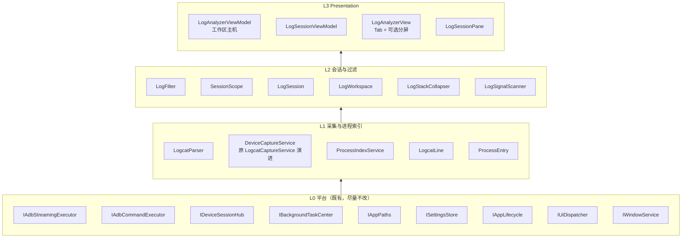

# 日志分析模块 — 功能细化与多窗口实现架构

> **状态：** 设计稿（仅文档，不改代码）  
> **日期：** 2026-08-12  
> **前置文档：** `docs/architecture/日志分析模块架构.md`、`docs/requirements/需求分析.md`、`docs/architecture/架构设计-v5.md`  
> **对照参考：** Android Studio Logcat（过滤交互）、Xshell（多会话 Tab / Tab Group 分屏）

---

## 0. 一句话结论

下一阶段做三件事：**砍掉低频工具能力** → **同一设备上 Xshell 式多会话窗（按包名/PID 划分）** → **过滤栏对齐 Android Studio Logcat 的产品形态**（控件化 + 轻量查询，不照搬完整 DSL）。

采集内核改为「设备级单流 + 多会话扇出」；包名通过进程索引映射到 PID 集合，并在应用重启后自动重绑。

---

## 1. 目标与非目标

### 1.1 目标

| # | 目标 | 成功标准 |
|---|------|----------|
| G1 | 自底向上移除无用能力 | 工具栏/领域/测试中不再出现被删能力；导出仍保留 txt |
| G2 | 多窗口采集 | 同一焦点设备可开 ≥2 个会话窗；可按包名或 PID 划分；支持 Tab + 分屏对照 |
| G3 | 过滤对齐 AS Logcat | 级别（含以上）+ 包名/进程 + Tag/消息检索成为主路径；交互一眼可读为「Logcat 工具」 |
| G4 | 架构可演进 | 会话与采集解耦；后续可加多设备 Tab / 撕窗，而不推翻内核 |

### 1.2 非目标（本期不做）

- 完整 Android Studio 查询 DSL（`age:`、`is:crash`、`~` 正则、`&`/`|` 任意嵌套）
- 多设备并行采集（仍跟全局焦点 `SingleRequired`；多窗 = 同设备多会话视图）
- 性能分析时间轴、录屏对齐、设备端悬浮窗
- 投屏联动（ADR-007）
- 重新引入命名过滤预设（本次明确移除）
- `logcat -b crash/radio` 多缓冲订阅（可列为远期）

### 1.3 与既有决策的关系

| 既有结论 | 本次调整 |
|----------|----------|
| 包名过滤 = P2 / 试点不做 | **升格为本期主能力**（多窗划分依赖） |
| 查询 DSL = 不做 | **仍不做完整 DSL**；改为「AS 形态的控件栏 + 可选轻量 key:value」 |
| 导出 txt + JSON | **保留 txt；移除 JSON 导出** |
| 单设备焦点停采 | **保持**：焦点切换/掉线 → 停掉该设备全部会话采集 |
| ADR-006 应用日志 vs 设备日志 | **不变** |

---

## 2. 能力裁剪：自底向上移除

> 用户表述「导入 JSON」：当前代码与 UI **仅有「导出 JSON」**（`ExportJson`），无导入能力。下文按 **移除导出 JSON** 处理，并在实现清单中核对无残留导入入口。

### 2.1 移除清单

| 能力 | 现状落点 | 移除理由 | 替代 |
|------|----------|----------|------|
| 导出 JSON | `ExportJsonCommand` / 工具栏按钮 / VM | 产线交付以 txt 为主；结构化 JSON 使用率低 | 保留「导出」txt（过滤后缓冲） |
| 复制选中 | `CopySelectedCommand` + Ctrl+C | 工具栏占位多；系统剪贴板/选区可覆盖 | 可选：列表原生选区 + 系统 Ctrl+C（非专用命令） |
| 复制可见 | `CopyVisibleCommand` | 大列表易误操作；与导出重叠 | 用「导出」得到过滤结果 |
| 软换行 | `IsSoftWrap` + Toggle + `BoolToTextWrapping` | 开关价值低；虚拟化下列高变化影响滚动稳定性 | 默认 **不换行**（`NoWrap` + 横向滚动），对齐 AS 默认 |
| 过滤预设 | `LogPresetStore` / 预设行 UI / Save/Delete | 多窗后「会话本身」即过滤器容器；预设与会话重复 | 会话标题 + 包名/PID 作用域持久化（见 §5） |

### 2.2 自底向上删除顺序（实现时遵循）

```text
L3 UI        → 工具栏按钮 / 预设行 / SoftWrap 绑定 / 快捷键 Ctrl+C 专用复制
L2 VM        → ExportJson / Copy* / IsSoftWrap / Presets / Save|DeletePreset / PromptPresetName
L1 领域/存储 → LogPresetStore + presets.json 读写；DisplayLine 仍可保留（堆栈折叠未在移除范围）
L0 共享壳    → 评估 BoolToTextWrappingConverter 是否仅日志使用；仅日志用则随模块清理或保留他处
测试         → LogPresetStoreTests / VM 中预设与 JSON 相关用例删除或改写
文档/设置    → 需求与旧架构文中「预设 / JSON 导出 / 软换行」状态回写为「已移除」
```

### 2.3 明确保留（裁剪后主路径）

- 开始 / 停止采集、暂停（冻 UI，缓冲继续）、清空（可见+缓冲）、清设备缓冲、导出 txt
- 自动滚底、级别着色、关键字高亮、信号计数、堆栈折叠（F34）、空格暂停 / Ctrl+L 清空 / Ctrl+F 聚焦检索
- 设置三项：`buffer.capacity` / `display.limit` / `clear.device.on.start`

### 2.4 快捷键调整（移除后）

| 快捷键 | 调整后 |
|--------|--------|
| Space | 暂停（采集中，非输入框）— 保留 |
| Ctrl+L | 清空 — 保留 |
| Ctrl+F | 聚焦检索框 — 保留（检索框语义见 §4） |
| Ctrl+C | **取消**模块专用「复制选中」；交还系统/文本框默认行为 |
| Ctrl+Tab / Ctrl+W / Ctrl+T | **新增**（多会话，见 §5.5） |

---

## 3. 产品形态总览

### 3.1 信息架构（单模块内）

```text
日志分析模块（跟全局焦点设备）
 └─ DeviceCapture（每设备至多 1 路 logcat 流）
     └─ Session[]（Xshell 式多窗）
         ├─ Scope：All | Package(pkg) | Pid(pid)
         ├─ Filter：level / tag / message（及轻量查询）
         ├─ ViewState：暂停 / 自动滚底 / 可见列表
         └─ 可选布局：Tab Group 分屏
```

**多窗含义（本期）：** 不是多台物理设备，而是 **同一设备上的多个 Log 会话视图**（对照 Xshell：同一主机多会话 Tab）。

### 3.2 界面草图

```text
┌─ 模块工具栏 ─────────────────────────────────────────────────────┐
│ [开始/停止] [暂停] [清空] [清设备缓冲] [导出]   设备: Pixel-xxx   │
├─ 会话 Tab 栏（Xshell）───────────────────────────────────────────┤
│ [全部日志] [com.example.app] [PID 4321]  [+]            ☰ 布局 │
├─ （可选分屏：Tab Group）─────────────────────────────────────────┤
│ ┌─ 会话 A ──────────────────┐  ┌─ 会话 B ─────────────────────┐ │
│ │ 级别[W▾] 包名[com.app▾]   │  │ 级别[E▾] 包名[—] PID[4321]  │ │
│ │ 检索 [ tag:OkHttp 超时 ]  │  │ 检索 [ ANR ]                 │ │
│ │───────────────────────────│  │──────────────────────────────│ │
│ │ 虚拟化日志列表            │  │ 虚拟化日志列表               │ │
│ └───────────────────────────┘  └──────────────────────────────┘ │
├─ 状态栏 ─────────────────────────────────────────────────────────┤
│ ● 采集中 · 缓冲 12,340 · 可见 890 · 信号 2 · 进程索引 3s 前更新 │
└──────────────────────────────────────────────────────────────────┘
```

### 3.3 与参考产品的映射

| 参考 | 借鉴点 | Yohu 落地 |
|------|--------|-----------|
| **AS Logcat** | 级别含以上；包名/进程一等公民；检索与过滤同屏；多 Logcat Tab | 过滤栏重构 + 包名选择器 + 多会话 Tab |
| **AS Logcat** | 统一 query 语法全家桶 | **不照搬**；先控件，后可选轻量 `key:value` |
| **Xshell** | 多 Tab、Tab Group、拖到边缘拆组、水平/垂直/平铺排列、合并组 | 会话 Tab + 分屏布局（分阶段） |
| **Xshell** | 每 Tab 独立会话状态 | 每 Session 独立 Scope/Filter/暂停/滚底 |
| **Xshell** | 多窗口进程级隔离 | **不**为每 Tab 起独立 adb 进程（见 §6） |

---

## 4. 过滤设计（对齐 Android Studio Logcat）

### 4.1 设计原则

1. **主路径控件化（像 AS 顶栏）：** 级别、包名/进程、检索框始终可见，不把关键过滤藏进对话框。  
2. **语义对齐 AS，语法克制：** `level` = 最低级别含以上；包名过滤 = 该包当前/历史 PID 集合；Tag/消息 = 包含匹配（大小写不敏感）。  
3. **不做完整 DSL 引擎：** 产线场景优先「点选 + 短文本」；避免正则框与复杂布尔解析。  
4. **过滤在消费端：** 采集写入全量环形缓冲；各会话独立 `Matches` → 可见列表（延续 F27 重放）。  
5. **多窗后过滤归属会话：** 不再有模块级唯一 `SelectedLevel`；每个 `LogSessionViewModel` 自持。

### 4.2 过滤维度（本期）

| 维度 | UI | 匹配语义 | 对齐 AS |
|------|-----|----------|---------|
| Level | 下拉：全部 / V / D / I / W / E / F | 最低级别含以上 | `level:WARN` |
| Package | 可搜索下拉（进程索引）+「全部」 | 行 PID ∈ 包名→PID 集合（含重绑历史，见 §6.3） | `package:com.foo` |
| PID | 数字框或从进程列表点选 | **精确** PID 相等（升级现状「包含匹配」） | `pid:1234` |
| Tag | 检索框内 `tag:` 或独立框（二选一，见 §4.4） | 包含，OrdinalIgnoreCase | `tag:Activity` |
| Message | 检索框自由文本 / `message:` | 消息或 Raw 包含 | 默认搜索消息 |
| 排除 | 可选 `-tag:` / `-message:`（阶段 B） | 否定 | `-tag:spam` |

**Package 与 PID 互斥规则（建议）：**

- 作用域 `Scope=Package` 时：PID 框只读显示「当前绑定 PID 列表」，不允许再叠一个冲突 PID。  
- 作用域 `Scope=Pid` 时：包名显示为解析到的包名（可空），过滤只认该 PID。  
- 作用域 `Scope=All` 时：包名/PID 均可空；若用户填了 PID，等价切到 `Scope=Pid`。

### 4.3 进程索引（包名能力的前提）

threadtime 行 **不含包名**，必须侧信道建立映射：

| 方案 | 命令 | 优点 | 缺点 |
|------|------|------|------|
| A. `pidof -s <pkg>` | 按需单包 | 简单 | 多包时多次调用；无进程名列表 |
| B. `ps -A -o PID,NAME` / `ps -A` | 周期性全量 | 一次拿到包名≈进程名列表 | 输出格式因 Android 版本略有差异 |
| C. `dumpsys activity processes` | 信息全 | 解析重 | 产线过重 |

**本期选定：B 为主，A 为单包刷新兜底。**

`ProcessIndexService`（模块 Application 层）：

- 输入：`DeviceSerial`  
- 输出：`IReadOnlyList<ProcessEntry>`（`Pid`, `ProcessName`≈包名, `LastSeenUtc`）  
- 刷新：采集中默认每 **2–3s**；设备空闲可降频或停  
- 事件：`Changed`，供包名下拉与 Session 重绑订阅  
- 失败：降级为「仅 PID 模式」，状态栏提示「进程索引不可用」

### 4.4 检索框：两阶段语法

#### 阶段 A（必做）— 控件 + 纯关键字

```text
[级别▾] [包名/进程▾] [PID    ] [ 关键字________ ] 
```

- 关键字只匹配 Message/Raw 包含（现状 F06）  
- Tag 保留独立输入框（现状）**或**并入关键字（二选一；推荐 **阶段 A 保留独立 Tag 框**，迁移成本低）

#### 阶段 B（可选增强）— 轻量 key:value（仍非完整 DSL）

检索框支持空格分隔的简单令牌（隐式 AND）：

| 令牌 | 含义 |
|------|------|
| `tag:Foo` | Tag 包含 Foo |
| `message:bar` / 无前缀 `bar` | 消息包含 |
| `pid:123` | 精确 PID（若与 Scope 冲突，以检索为准并提示） |
| `-tag:Foo` | 排除 Tag |
| `level:W` | 与级别下拉同步（写检索时回写下拉，避免双真源） |

**明确不做（阶段 B 也不做）：** `tag~:` 正则、括号、`|` OR、`age:`、`package:mine`、`is:crash`（崩溃仍靠现有 SignalScanner 徽章）。

### 4.5 过滤管道（伪代码）

```text
pass =
  ScopeAll OR ScopePid(line.Pid == scope.Pid)
           OR ScopePackage(line.Pid in scope.PidSetIncludingHistory)
  AND MeetsMinLevel(line.Level, minLevel)
  AND TagContains(...)
  AND MessageContains(...)
  AND NotExcluded(...)
```

`LogFilterOptions` 演进建议：

```csharp
// 概念模型（设计态，非实现）
record LogFilterOptions(
    string? MinLevel,
    string? Tag,
    string? Keyword,
    SessionScope Scope,           // All | Package | Pid
    IReadOnlySet<string> PidSet,  // 包名作用域下的 PID 集合（含历史）
    string? ExactPid,             // Pid 作用域
    IReadOnlyList<ExcludeTerm>? Excludes // 阶段 B
);
```

### 4.6 过滤变更行为（延续并扩展 F27）

- 任一过滤字段变更 → **仅当前会话** `RebuildVisibleFromBuffer`  
- 重放范围：设备共享缓冲快照 → 会话过滤 → 尾部 `display.limit`  
- 堆栈折叠仍在显示层（`LogStackCollapser`）  
- 暂停只冻当前会话 UI；其他会话照常刷新

---

## 5. 多窗口架构（对齐 Xshell）

### 5.1 核心概念

| 概念 | 定义 | Xshell 对应 |
|------|------|-------------|
| **Session（会话）** | 一个独立日志视图：Scope + Filter + ViewState | 一个 Tab 会话 |
| **SessionTab** | Tab 栏条目：标题、激活态、关闭、颜色可选 | Session Tab |
| **TabGroup（窗格）** | 一组 Tab，组内同时只显示一个激活 Tab；多组 = 分屏 | Tab Group |
| **Layout** | 单组 / 左右 / 上下 / 2×2 平铺 | Arrange Tabs |
| **DeviceCapture** | 每设备一路采集 + 共享环形缓冲 | （Xshell 无对等；我们为性能特化） |
| **Workspace** | 模块级会话集合 + 布局 + 与焦点设备绑定 | Xshell 窗口 |

### 5.2 会话划分方式

创建会话时用户选择 **Scope**：

| Scope | 标题默认 | 过滤行为 | 典型场景 |
|-------|----------|----------|----------|
| `All` | `全部日志` | 不过滤进程 | 总览噪声/系统 |
| `Package` | `com.foo.bar` | PID ∈ 映射集合（含重绑） | 跟某一个 APK |
| `Pid` | `PID 12345` | 精确 PID | 子进程 / native |

**新建入口（`[+]`）：**

1. 新建「全部日志」  
2. 从进程列表选包名 → `Package` 会话  
3. 输入/粘贴 PID → `Pid` 会话  
4. 「从当前检索固化为会话」（阶段 B：把当前过滤另存为新 Tab）

### 5.3 布局与交互（分阶段）

#### 阶段 M1 — 多 Tab（必做）

- 单 TabGroup，顶部 Tab 栏  
- `+` 新建、中键/关闭按钮关 Tab  
- 至少保留 1 个会话；关闭最后一个时重建默认 `All`  
- Ctrl+Tab / Ctrl+Shift+Tab 切换；Ctrl+T 新建；Ctrl+W 关闭  
- 每 Tab 独立：过滤、暂停、滚底、选中行、信号计数（会话级）

#### 阶段 M2 — Tab Group 分屏（应对「对照」）

- 拖拽 Tab 到内容区左/右/上/下边缘 → 新建 TabGroup（Xshell 手势）  
- 菜单：「左右分屏」「上下分屏」「合并全部」  
- 每组独立激活 Tab；全局仍共享同一 `DeviceCapture`  
- 工具栏「开始/停止」作用于 **设备采集**（全部窗格共用一路流）；「暂停/清空」默认作用于 **当前焦点会话**（可后续加「清空全部会话可见区」）

#### 阶段 M3 — 撕出独立窗口（可选）

- 复用 `IWindowService`（Shell 已有端口）  
- 撕出窗仍绑同一模块 Workspace / 同一 DeviceCapture  
- 主窗关闭或模块 Dispose → 子窗一并关闭并停采

### 5.4 设备焦点与生命周期

```text
ActiveDeviceChanged / DeviceOffline
  → Workspace.OnDeviceLost()
      → DeviceCapture.Stop()
      → 所有 Session.IsCapturing=false
      → Status：「设备已切换/掉线，采集已停止」
      → Session 列表可保留（过滤条件不丢），缓冲策略见下
```

**缓冲策略（决策）：**

| 事件 | 缓冲 | 会话 |
|------|------|------|
| 用户停止采集 | 保留 | 保留，可继续过滤重放 |
| 用户清空 | 清共享缓冲 + 各会话可见区 | 保留 |
| 设备切换/掉线 | **清空共享缓冲**（避免串设备） | 保留 Session 配置；可见区清空 |
| 应用退出 | Stop + Dispose | — |

### 5.5 采集控制权责

| 操作 | 作用域 | 说明 |
|------|--------|------|
| 开始采集 | Device | 若已在采则 no-op；登记 1 个 BackgroundTask |
| 停止采集 | Device | 停流；各会话 Drain 停更 |
| 暂停 | Session | 仅冻该会话 UI |
| 清空 | Session（默认） | 清该会话可见；可选「同时清共享缓冲」需确认框 |
| 清设备缓冲 | Device | `logcat -c`；建议同时 Clear 共享缓冲并重建各可见区 |
| 导出 | Session | 导出 **该会话过滤后** 的缓冲快照为 txt |

后台任务：仍 **每设备一条**「logcat 采集」，Detail = 设备名 + 会话数（如 `3 sessions`）。

---

## 6. 实现架构（自底向上）

### 6.1 分层总图



### 6.2 类型职责

| 类型 | 生命周期 | 职责 |
|------|----------|------|
| `DeviceCaptureService` | 模块单例 | 单设备世代采集、共享环形缓冲、行 fan-out Channel/多订阅 |
| `ProcessIndexService` | 模块单例 | 周期性 `ps`、包名↔PID、变更事件 |
| `LogWorkspace` | 模块单例或随 VM | Session 集合、布局、当前焦点 Session、设备绑定 |
| `LogSession` | 多实例 | 不可变/可变配置：Id、Title、Scope、Filter、CreatedUtc |
| `LogSessionViewModel` | 每 Session | VisibleLines、暂停、重放、导出、会话状态文案 |
| `LogAnalyzerViewModel` | 模块单例 | 工作区主机：采集开关、Tab 命令、布局、设备事件 |
| `LogFilter` | 静态纯函数 | Matches；扩展 PidSet / ExactPid |
| `LogPresetStore` | — | **删除** |

### 6.3 采集 fan-out（关键决策）

**ADR-LA-001：同设备单流多视图**

- 只跑 **一条** `adb logcat -v threadtime`  
- 解析后写入共享环形缓冲，并广播给所有 Session 的消费端  
- 各 Session 自行过滤；**禁止**每 Tab 起一个 logcat（避免 adb 压力与时钟错位）

实现选项：

| 选项 | 做法 | 建议 |
|------|------|------|
| 1 | 保持单 Channel，Workspace 内一个 Drain 再分发到各 Session | 简单，控制 UI 节流统一 |
| 2 | `Channel` 多 Reader（Broadcast） | 需自定义广播；复杂度高 |
| **推荐** | **选项 1**：`DeviceCaptureService` 产出行 → `Workspace.Dispatch(line)` → 各未暂停 Session 过滤追加 | 易测、易限流 |

```text
adb logcat
  → CaptureGeneration (parse + ring buffer)
  → Workspace.OnLines(batch)   // 100ms 节流可放这里或 Session 侧
      → foreach session: if !paused && Matches → AppendVisible
```

### 6.4 包名 PID 重绑

```text
PackageScope(com.foo)
  PidSet = { 当前 ps 中所有 processName==com.foo 的 pid }
  HistoryPidSet = 会话期内曾经出现过的 pid（上限 N，如 8）

行匹配：line.Pid ∈ (PidSet ∪ HistoryPidSet)
```

- **为何保留 History：** 应用崩溃重启后旧 PID 行仍应留在该包会话时间线中（对照 LogcatOn / AS 体验）。  
- **清空策略：** 用户「清空」会话时可选清空 History；设备切换时强制清空。  
- **多进程包：** 同一包名多个 PID（含 `:push` 等）全部纳入 PidSet。  
- **进程名后缀：** `com.foo:remote` 是否归入 `com.foo`？  
  - **决策：** 默认 **精确匹配** 进程名；下拉提供「包含子进程」开关（默认关），开启则前缀匹配 `com.foo` 与 `com.foo:*`。

### 6.5 目录结构（目标）

```text
Yohu.Modules.LogAnalyzer/
  Application/
    LogcatParser.cs
    LogcatLine.cs
    DeviceCaptureService.cs      ← 由 LogcatCaptureService 重命名/演进
    ProcessIndexService.cs       ← 新增
    ProcessEntry.cs
    LogFilter.cs                 ← 扩展
    LogSession.cs / SessionScope.cs
    LogWorkspace.cs
    LogStackCollapser.cs
    LogSignalScanner.cs
    # LogPresetStore.cs          ← 删除
  Presentation/
    ViewModels/
      LogAnalyzerViewModel.cs    ← 工作区主机
      LogSessionViewModel.cs     ← 新增
    Views/
      LogAnalyzerView.xaml       ← Tab + 布局宿主
      LogSessionPane.xaml        ← 单会话过滤栏+列表（新增）
```

模块数据目录：

```text
ModuleData(log-analyzer)/
  exports/                 ← txt 导出
  config/
    workspace.json         ← 可选：上次会话 Scope/标题/布局（不含日志正文）
    # presets.json         ← 删除；迁移时忽略
```

### 6.6 DI 注册变化

```text
// 概念
services.AddSingleton<DeviceCaptureService>();
services.AddSingleton<ProcessIndexService>();
services.AddSingleton<LogWorkspace>();
services.AddSingleton<LogAnalyzerViewModel>();
// LogSessionViewModel：由 Workspace 工厂创建，不注册为单例
// 删除 LogPresetStore
```

### 6.7 平台层是否需要改？

| 能力 | 结论 |
|------|------|
| `IAdbStreamingExecutor` | 够用，不改 |
| `IAdbCommandExecutor` | `ps` / `pidof` / `logcat -c` 够用 |
| `IDeviceSessionHub` | 仍 `SingleRequired` |
| `IBackgroundTaskCenter` | 每设备一条任务 |
| `IWindowService` | 仅 M3 撕窗需要 |
| 新平台契约 | **本期不需要**；进程索引留在模块内 |

---

## 7. UI 详细规格

### 7.1 模块工具栏（裁剪后）

`开始/停止 | 暂停 | 清空 | 清设备缓冲 | 导出`  
（无：导出 JSON / 复制\* / 软换行 / 预设）

### 7.2 会话 Tab 栏

- 标题：Scope 派生，可双击重命名  
- 图标/颜色：采集中绿点；有信号时红点（会话级 SignalCount>0）  
- 右键：关闭、关闭其他、左右/上下拆分（M2）、复制会话（同 Scope 新 Tab）

### 7.3 会话内过滤栏（AS 风格）

**推荐布局（单行）：**

```text
级别 [W▾]   包名/进程 [com.example.app▾ ▼]   PID [    ]   检索 [          ] 
```

- 包名下拉：顶部「全部进程」；下方按最近/字母序列出 `ProcessEntry`；支持打字过滤  
- 选包名 → Scope=Package，清 ExactPid  
- 填 PID → Scope=Pid，包名显示解析结果（只读提示）  
- 级别变更 / 检索变更 → 即时重放  

列表：虚拟化、级别色、关键字高亮、堆栈折叠、**NoWrap + 横向滚动**。

### 7.4 状态栏

`采集指示 · 设备名 · 缓冲行数 · 当前会话可见行数 · 信号 · 进程索引年龄`

---

## 8. 关键流

### 8.1 首次进入模块

```text
1. 绑定 ActiveDevice
2. Workspace 若无会话 → 创建默认 Session(All, title=全部日志)
3. 用户点开始 → 可选 logcat -c → DeviceCapture.Start
4. ProcessIndex 开始刷新
5. 行 fan-out → 默认会话显示
```

### 8.2 按包名开窗

```text
1. 用户 [+] → 选择包名 com.foo
2. Workspace.Add(Session(Package, com.foo))
3. 立即用当前缓冲重放该会话可见区
4. 后续行按 PidSet∪History 过滤
5. 索引刷新发现 PID 变化 → 更新 PidSet，可选触发轻量重放（仅当集合变化）
```

### 8.3 分屏对照（M2）

```text
SessionA: Package=com.foo, level=W
SessionB: All, keyword=ANR
左右 TabGroup 同时滚 — 共享缓冲，双视图
```

---

## 9. 功能清单（相对旧 F 编号）

### 9.1 移除

| 旧编号 | 能力 | 动作 |
|--------|------|------|
| F20 | 软换行开关 | 移除；固定 NoWrap |
| F23 | 复制选中/可见 | 移除专用命令 |
| F31 | 命名过滤预设 | 移除 |
| F32 | 导出 JSON | 移除 |

### 9.2 保留（行为归属调整）

| 编号 | 能力 | 调整 |
|------|------|------|
| F01–F12 | 采集基线 | 采集升到 Device；UI 多会话 |
| F21 | 自动滚底 | **每会话**独立 |
| F22 | 清设备缓冲 | Device 级 |
| F24–F27 | 高亮/PID/信号/重放 | 信号与重放 **每会话**；PID 改为精确 + Scope |
| F34–F35 | 折叠/快捷键 | 保留；Ctrl+C 专用复制去掉 |

### 9.3 新增

| 编号 | 能力 | 阶段 |
|------|------|------|
| F40 | 会话 Workspace + 多 Tab | M1 |
| F41 | 按包名创建会话 + ProcessIndex | M1 |
| F42 | 按 PID 创建会话 | M1 |
| F43 | 包名 PID 自动重绑 + HistoryPidSet | M1 |
| F44 | AS 风格过滤栏（级别/包名/PID/检索） | M1 |
| F45 | Tab Group 左右/上下分屏 + 合并 | M2 |
| F46 | 轻量检索令牌 `tag:` / `-tag:` | B（可选） |
| F47 | workspace.json 恢复上次会话配置 | M2 或按需 |
| F48 | 撕出独立窗口 | M3 可选 |

---

## 10. 落地排期

| 阶段 | 内容 | 依赖 | 预估 |
|------|------|------|------|
| **R0 裁剪** | 移除 JSON 导出/复制/软换行/预设；测试与文档回写 | 无 | 0.5–1 日 |
| **M1 多 Tab + 包名** | DeviceCapture fan-out、ProcessIndex、Session VM、AS 过滤栏、包名/PID 开窗 | R0 | 3–5 日 |
| **M2 分屏** | TabGroup 布局、拖拽拆分、排列菜单、workspace 持久化 | M1 | 2–3 日 |
| **B 轻量 query** | 检索令牌解析（无正则） | M1 | 1 日 |
| **M3 撕窗** | IWindowService 宿主 | M2 | 按需 |

**建议交付切片：** 先合 R0+M1（可用的多窗包名对照），再 M2。

---

## 11. 测试要点

| 层 | 场景 |
|----|------|
| ProcessIndex | 解析多版 `ps` 样例；空输出；权限失败降级 |
| LogFilter | Package PidSet、History、ExactPid、级别含以上、排除令牌 |
| DeviceCapture | 单流；Stop→Start 世代；缓冲环形裁剪 |
| Workspace | 多 Session 独立暂停；关最后 Tab 重建；设备切换清缓冲 |
| VM/UI | 开 3 Tab 过滤互不污染；导出仅当前会话；后台任务仅 1 条 |
| 性能 | 50k 缓冲 + 3 会话可见上限内 UI 可交互（节流+虚拟化） |
| 回归 | R0 后无预设/JSON/SoftWrap 符号残留（可加架构或简单 grep 测试） |

---

## 12. 决策记录（本次新增）

| ID | 决策 | 结论 |
|----|------|------|
| ADR-LA-001 | 多窗采集模型 | **同设备单 logcat 流 + 多会话扇出**；不按 Tab 起进程 |
| ADR-LA-002 | 包名实现 | `ProcessIndex` 周期 `ps`；Scope=Package 用 PidSet∪History |
| ADR-LA-003 | 过滤产品形态 | **对齐 AS 控件布局与语义**；完整 query DSL 仍不做 |
| ADR-LA-004 | 软换行 | 移除开关；默认 NoWrap |
| ADR-LA-005 | 预设 / JSON 导出 / 专用复制 | 移除；会话取代预设；txt 导出取代复制可见 |
| ADR-LA-006 | 多设备多窗 | 本期不做；仍 SingleRequired |
| ADR-LA-007 | PID 匹配 | 由「包含」升级为 **精确相等**（Scope=Pid） |
| ADR-LA-008 | 子进程包名 | 默认精确进程名；可选「包含子进程」前缀匹配 |

---

## 13. 文档与需求回写清单（实现阶段执行）

- [x] `日志分析模块架构.md`：文件已随审查清理删除；F20/F23/F31/F32 移除落点见本文件 §9.1
- [x] `需求分析.md` §4.3 / §8：包名由「试点不做」改为「多窗 Scope 已实现」；JSON/预设表述删除
- [x] `CLAUDE.md` 核心功能第 4 条：去掉预设；写明多会话与包名/PID
- [x] 本文件：R0 + M1 阶段已实现（见下）

## 13.1 实现状态（R0 + M1 已于 2026-08-12 落地）

| 阶段 | 状态 | 说明 |
|------|------|------|
| **R0 裁剪** | ✅ | JSON 导出/复制选中/复制可见/软换行/预设全部移除；BoolToTextWrappingConverter 随模块清理；LogPresetStore + presets.json 删除 |
| **M1 多 Tab + 包名** | ✅ | DeviceCaptureService 单流扇出、ProcessIndexService（ps 周期 2.5s + 降级）、Session/Workspace 域层、LogSessionViewModel + LogSessionPane、AS 过滤栏（级别/包名含子进程开关/PID/检索）、包名/PID 开窗、Ctrl+T/W/Tab 快捷键、后台任务明细含会话数 |
| M2 分屏 | ⬜ | 未开始（下一交付切片） |
| B 轻量 query | ⬜ | 未开始（M1 用独立 Tag+关键字） |
| M3 撕窗 | ⬜ | 未开始（按需） |  

---

## 14. 开放问题（实现前可再确认）

1. **清空语义：** 会话「清空」是否默认只清可见，还是连同共享缓冲？建议：默认只清当前可见 + 确认框「同时清空采集缓冲」。  
2. **workspace.json：** 是否在 M1 就持久化会话列表？建议：M1 仅内存；M2 再持久化。  
3. **阶段 B 轻量 query：** 是否进入第一期交付？建议：M1 先独立 Tag+关键字；B 看产线反馈。  
4. **「导入 JSON」：** 已按「导出 JSON」移除理解；若确有外部 JSON 导入需求，需另开需求（当前无代码）。

---

**文档结束。**
