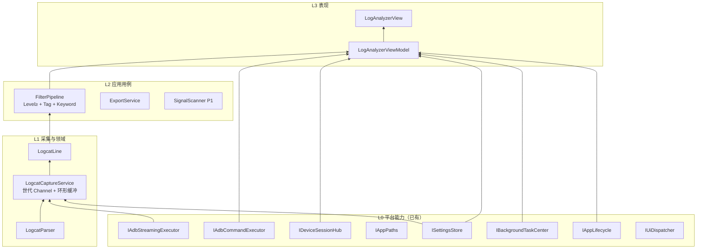

# 日志分析模块 — 架构设计（自底向上）

> **状态：** 现行实现基线 + 下一阶段演进蓝图  
> **日期：** 2026-08-11  
> **模块 Id：** `log-analyzer`  
> **关联：** `docs/requirements/需求分析.md`、`docs/architecture/架构设计-v5.md`  
> **参考产品：** [Android Studio Logcat](https://developer.android.com/studio/debug/logcat)、[LogcatOn](https://qwerfunch.github.io/logcat-on-releases/)、[BeautyCat](https://github.com/jeziellago/beautycat)、[Logcat Desk](https://github.com/florextech/logcat-desk)、[CatSpy](https://github.com/Gegenbauer/CatSpy)、MatLog / Logcat Extreme（设备端）

---

## 0. 一句话结论

自底向上：先钉死 **ADB 流式采集 → 解析 → 环形缓冲 → 消费端过滤 → 虚拟化 UI** 这条管道；  
过滤交互对齐业界「级别含以上 + Tag + 关键字」，**去掉正则框**；  
设置页只挂**缓冲/显示/开采前清空**三项必要旋钮；高级能力（包名/信号/预设）按阶段加，不堵产线主路径。

---

## 1. 业界能力调研摘要

### 1.1 Android Studio Logcat（官方基线）

| 能力 | 说明 | 我们取舍 |
|------|------|----------|
| 结构化字段 | 时间、PID/TID、Tag、包名、级别、消息 | ✅ 已解析 threadtime（除包名） |
| 查询栏 | `tag:` / `level:` / `package:` / `message:` / `age:` / `-` 排除 / `~` 正则 | ❌ 本期不做完整查询 DSL；用简单控件替代 |
| `level:` 含以上 | `level:WARN` ⇒ W+E+Assert | ✅ **已对齐**（最低级别） |
| Soft-Wrap | 长行自动换行 | P1 |
| 格式 Standard/Compact | 列显隐 | P2 |
| 缓冲/历史行数设置 | Settings → Tools → Logcat | ✅ 设置页已提供缓冲/显示上限 |
| 多窗口/多设备 Tab | 同时看多设备 | ❌ 单设备焦点（产线够用） |
| 收藏查询 / 历史 | 常用过滤器 | P2 过滤预设 |

### 1.2 优秀第三方桌面/工具

| 产品 | 突出能力 | 我们取舍 |
|------|----------|----------|
| **LogcatOn** | 包名→PID 自动重绑、崩溃/ANR 信号、百万行虚拟化、书签 | 虚拟化 ✅；信号/包名 P1–P2；书签远期 |
| **BeautyCat** | 级别含以上、Tag/包/PID、暂停、自动滚底、导出 txt/json、快捷键、堆栈折叠 | 多数进 P0/P1；json/折叠 P2 |
| **Logcat Desk** | 实时流、关键字、暂停、清设备缓冲、导出、复制 | ✅ 对齐产线刚需 |
| **CatSpy** | 多 Tab、书签、自定义解析器 | 远期 |
| **MatLog / Extreme** | 设备端悬浮窗 | 不做（我们是 PC 工作台） |

### 1.3 产线场景裁剪原则

1. **先稳再炫：** 启停可靠、不卡死、退出无孤儿进程（已修世代状态机）。  
2. **少控件、准语义：** 不要半残正则框；关键字包含即可。  
3. **设置要少：** 只暴露影响内存/噪声的旋钮。  
4. **不复制 AS 全家桶：** 查询 DSL、多设备 Tab、性能时间轴放到远期。

---

## 2. 功能清单（完整）与优先级

### P0 — 产线可用（当前应具备 / 已具备）

| # | 功能 | 状态 |
|---|------|------|
| F01 | 选中焦点设备后开始/停止流式采集 | ✅ |
| F02 | `logcat -v threadtime` 解析（时间/PID/TID/级别/Tag/消息） | ✅ |
| F03 | 环形缓冲 + 快照导出 | ✅ |
| F04 | 最低级别过滤（含以上） | ✅（刚对齐 AS） |
| F05 | Tag 包含过滤 | ✅ |
| F06 | **关键字包含过滤（消息/原文）** | ✅（**替换原正则框**） |
| F07 | 暂停（冻 UI，缓冲继续）/ 清空 / 导出 txt | ✅ |
| F08 | 级别着色（E/F/W/D） | ✅ |
| F09 | 虚拟化列表 + UI 批量节流 | ✅ |
| F10 | 后台任务登记；退出/Dispose 停采 | ✅ |
| F11 | 设备掉线或切换 → 停采 | ✅ |
| F12 | 设置：缓冲行数 / 显示行数 / 开采前 `logcat -c` | ✅ |

### P1 — 下一迭代（**已全部落地**，2026-08-12）

| # | 功能 | 状态 | 实现 |
|---|------|------|------|
| F20 | **软换行开关** | ✅ | 工具栏 Toggle（`IsSoftWrap`，默认开，对齐 AS Soft-Wrap） |
| F21 | **自动滚底** | ✅ | 贴底跟随；用户上滚解锁；滚回底部重新锁定 |
| F22 | **清空设备缓冲按钮** | ✅ | 独立 `logcat -c` 按钮 + 设置项「开采前清空」 |
| F23 | **复制选中行 / 复制可见** | ✅ | 剪贴板原文（折叠行输出完整原文） |
| F24 | **关键字命中高亮** | ✅ | `LogLineHighlight` 行内高亮（命中段 Accent+Bold，非正则） |
| F25 | **PID 过滤** | ✅ | 文本框包含匹配 |
| F26 | **崩溃/异常粗信号** | ✅ | `LogSignalScanner`（FATAL EXCEPTION/AndroidRuntime/ANR）+ 状态栏计数徽章 |
| F27 | 过滤变更后**重放缓冲到可见列表** | ✅ | `RebuildVisibleFromBuffer`（尾部截断 display.limit） |
| F28 | 世代/启动失败 UX | ✅ | 失败提示明确；世代状态机 + 回归测试 |

**迭代 C 按需已落地（2026-08-12）：** F31 命名过滤预设（`LogPresetStore` config/presets.json）、F32 导出 JSON（可见行结构化）、F34 堆栈折叠（`LogStackCollapser` 连续栈帧折叠 +N 摘要，复制/导出含完整原文）、F35 快捷键（空格暂停/Ctrl+L 清空/Ctrl+C 复制/Ctrl+F 聚焦）。

### P2 — 增强

| # | 功能 | 说明 |
|---|------|------|
| F30 | 包名过滤（`ps`/`pidof` → PID 映射，应用重启重绑） | LogcatOn 核心能力，成本高 |
| F31 | 命名过滤预设（本地 JSON） | BeautyCat presets |
| F32 | 导出 JSON；可选「仅可见 / 全缓冲」 | |
| F33 | 列显隐（Compact/Standard） | |
| F34 | 堆栈多行折叠 | |
| F35 | 快捷键（空格暂停、Ctrl+L 清空等） | |
| F36 | 同时订阅 `crash`/`main` 缓冲 | `logcat -b all` 需评估噪声 |

### 明确不做（本期/近端）

- 完整 AS 查询 DSL / 正则模式切换  
- 多设备并排 Logcat Tab  
- 性能监控时间轴、录屏对齐  
- 设备端悬浮窗  
- 投屏联动  

---

## 3. 自底向上分层



### 3.1 L0 — 平台依赖（不扩展则不动）

| 端口 | 用途 |
|------|------|
| `IAdbStreamingExecutor` | `logcat -v threadtime` 流 |
| `IAdbCommandExecutor` | `logcat -c`、可选 `ps` |
| `IDeviceSessionHub` | 单设备焦点 + 掉线/切换 |
| `ISettingsStore` | 模块 scope `log-analyzer` |
| `IAppPaths.ModuleData` | `exports/` |
| `IBackgroundTaskCenter` | 采集中指示 |
| `IAppLifecycle.ShutdownToken` | 退出取消 |
| `IUiDispatcher` | 后台→UI |

**禁止：** 把 logcat 写入 `IAppLog`。

### 3.2 L1 — 采集内核（模块自持）

**`LogcatCaptureService`**

- **世代（Generation）：** 一次 Start = 一组 `{Channel, Process, CTS}`；旧 finally 不得 Complete 新 Channel、不得误发 `CaptureStopped`。  
- **Start 失败回滚：** 完成通道、清世代，保证 Drain 可续接。  
- **环形缓冲：** 容量读设置 `buffer.capacity`（钳制 1k–500k）。  
- **Stop：** Kill 树 + Complete 本世代。

**`LogcatParser`**

- 仅 threadtime；解析失败行丢弃（或 P2 进 Raw-only 桶）。

**`LogcatLine`**

- 不可变：Timestamp, Pid, Tid, Level, Tag, Message, Raw。

### 3.3 L2 — 过滤与导出

**当前（内联于 VM，可抽 `LogFilter`）：**

```
pass = LevelMeetsMin(line, minLevel)
    && TagContains(line, tag)
    && KeywordContains(line.Message|Raw, keyword)
```

- **无正则。** 关键字：`OrdinalIgnoreCase` 包含。  
- **级别：** `V < D < I < W < E < F`，选中值为最低门槛。

**P1：** 过滤条件变更 → `RebuildVisibleFromBuffer()`。  
**P1：** `SignalScanner` 对缓冲/新行打标（不改 Raw）。

**导出：** 过滤后 `Raw` 行写入  
`{ModuleData}/exports/logcat-yyyyMMdd-HHmmss.txt`。

### 3.4 L3 — UI

| 区域 | 内容 |
|------|------|
| 工具栏 | 开始/停止、暂停、清空、导出；（P1）清设备缓冲、软换行 |
| 过滤行 | 级别、Tag、**关键字**（无正则） |
| 列表 | 虚拟化 ListView；级别色；P1 自动滚底 |
| 状态栏 | 采集点 + 文案；（P1）可见行数 / 信号计数 |

设备选择：**不在本页重复造设备列表**，用 Shell 设备栏焦点。

---

## 4. 设置清单（自底向上 · 必要项）

> 原则：没有运行时压力或噪声问题的项不上设置页。

### 4.1 已上设置页

| 键 | Scope | 默认 | 生效 | 谁读 |
|----|-------|------|------|------|
| `adb.path` | app | 空 | 立即 | ToolResolver |
| `data.root` | app | LocalAppData/.../data | 重启 | AppPaths 快照 |
| `buffer.capacity` | module:log-analyzer | 50000 | 下次写入缓冲 | CaptureService |
| `display.limit` | module:log-analyzer | 2000 | 进程内构造 VM 时读 | ViewModel |
| `clear.device.on.start` | module:log-analyzer | false | 下次开始采集 | ViewModel |

Shell 设置页用**字符串约定**读写上述模块键，**不引用** Modules 程序集（保持依赖方向）。

### 4.2 候选（未上页，需要时再加）

| 键 | 用途 | 为何暂缓 |
|----|------|----------|
| `soft.wrap` | 软换行 | 可先做工具栏开关，不一定进设置 |
| `auto.scroll` | 默认自动滚底 | 同上 |
| `logcat.format` | threadtime / 其他 | 单一格式够用 |
| `buffers` | main/crash/all | 噪声与性能未评估 |

### 4.3 非设置（交互内完成）

- 级别 / Tag / 关键字：过滤栏即时  
- 暂停 / 清空 / 导出：工具栏  

---

## 5. 关键流程

### 5.1 开始采集

```
用户点开始
 → 校验 ActiveDevice
 → linked CTS(ShutdownToken)
 → if clear.device.on.start: adb logcat -c
 → CaptureService.StartAsync(serial)
 → 登记 BackgroundTask
 → IsCapturing=true
```

### 5.2 停止 / 退出

```
Stop / 设备切换 / Dispose / Shutdown
 → Kill 世代进程
 → Complete Channel
 → Complete/Cancel BackgroundTask
 → UI IsCapturing=false
```

### 5.3 过滤（目标 P1 行为）

```
过滤条件变更
 → 清空 VisibleLines
 → BufferSnapshot × Filter → 填入（截断 display.limit）
 → 后续 Drain 只追加通过过滤的新行
```

（当前实现：仅对**新到的行**过滤；改条件不重放历史 — **P1-F27** 补齐。）

---

## 6. 目录与类型

```
Modules/Yovo.Modules.LogAnalyzer/
  LogAnalyzerModule.cs
  Application/
    LogcatLine.cs
    LogcatParser.cs
    LogcatCaptureService.cs
    LogFilter.cs              ← P1 建议抽出
    LogSignalScanner.cs       ← P1
  Presentation/
    ViewModels/LogAnalyzerViewModel.cs
    Views/LogAnalyzerView.xaml
```

数据：

```
{DataRoot}/modules/log-analyzer/
  exports/
  config/   ← 若未来预设 JSON；设置本体在 SettingsRoot
```

---

## 7. 测试要点

| 场景 | 断言 |
|------|------|
| Stop→立即 Start | 旧 finally 不关新 Channel、不误停 UI |
| Start 抛错 | Channel 完成或回滚；Drain 可再次开始 |
| 级别含以上 | min=W 时 D 被滤、E 保留 |
| 关键字 | 大小写不敏感包含；无正则引擎 |
| clear.on.start | 开始前调用 `logcat -c`（Fake Adb） |
| 掉线/切换 | Action 触发停采 |

---

## 8. 落地排期（重点开发）

| 阶段 | 内容 | 预估 |
|------|------|------|
| **已完成基线** | F01–F12；去正则改关键字；设置三项 | ✅ 已落地 |
| **迭代 A** | F20–F24、F27、F28 回归加固 | ✅ 已落地（2026-08-12） |
| **迭代 B** | F25–F26 信号 + PID | ✅ 已落地（2026-08-12） |
| **迭代 C** | F30–F35 按需挑选 | 部分落地：F31/F32/F34/F35；F30 包名过滤 / F33 列显隐 / F36 多缓冲仍按需 |

---

## 9. 决策记录（本模块）

| 决策 | 结论 |
|------|------|
| 过滤交互 | 级别含以上 + Tag + 关键字；**删除正则输入框** |
| 设备模型 | SingleRequired = 全局焦点；不造第二套设备列表 |
| 设置 | 仅缓冲/显示/开采清空；Shell 字符串约定写模块 scope |
| 包名过滤 | P2（需 PID 映射） |
| 查询 DSL | 不做 |
| 与 IAppLog | 严格分离 |

---

**文档结束。**
