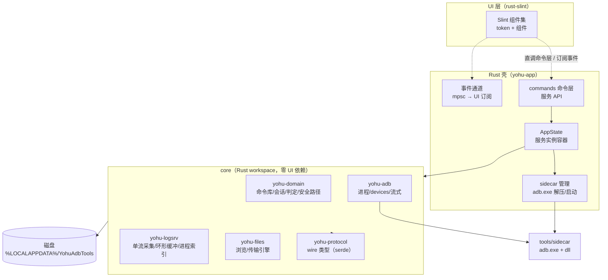
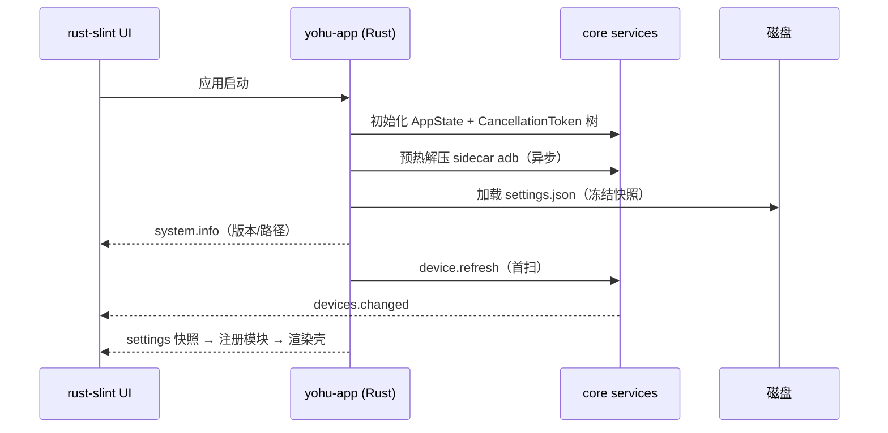
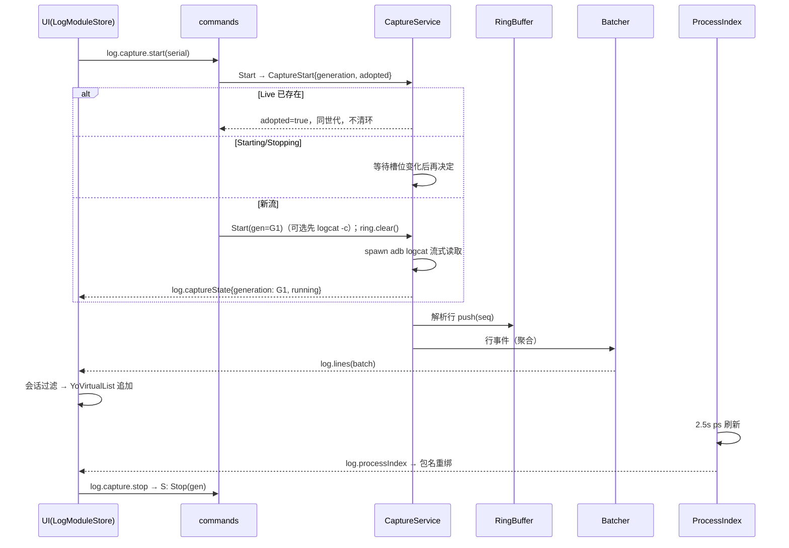

# Yohu ADB Tools — 架构设计（Slint 版）

> **状态：** 设计定稿（S1–S4 core 已落地，Slint UI 接入中）  
> **日期：** 2026-08-14  
> **配套文档：** `docs/requirements/需求分析.md`、`docs/architecture/UI设计系统-slint.md`、`docs/architecture/动画系统-slint.md`、`docs/architecture/文件拖拽-slint.md`、`docs/architecture/右键菜单-slint.md`  
> **定位声明：** 本架构为**推倒重来的全新设计**，不兼容旧设计与旧代码。旧架构（C#/WPF 模块化单体）与旧文档仅作历史存档。

---

## 0. 一句话结论

**Rust 领域核心 + Rust 桌面壳（组合根）+ rust-slint 原生 UI** 的模块化单体：核心逻辑全部下沉到零 UI 依赖的 Rust workspace（可独立测试、未来可服务化），UI 全部由自研 Slint 组件集构建；logcat 等高频数据走**批量事件通道**；安装包目标 **≤ 12 MB**，不捆绑任何语言运行时，无 WebView/前端栈。

---

## 1. 设计目标与非目标

### 1.1 目标

| # | 目标 | 成功标准 |
|---|------|----------|
| G1 | 轻量化 | 安装包 ≤ 12 MB；无 .NET / 无自包含运行时 / 无 WebView |
| G2 | 自研 UI 组件集 | 界面 100% 由自研 Slint 组件集构成（设计 token 单源）；零第三方组件库 |
| G3 | 功能完善 | 终端 / 文件 / 日志三模块对齐需求文档 §5；多会话日志为基线 |
| G4 | 性能 | 默认 10k 环形缓冲（`buffer_capacity` 可配）+ 3 会话 + 虚拟列表可交互；离开底部冻结可见区；批量事件，禁逐行 |
| G5 | 中文体验 | 中文输入零缺陷（Slint IME 专项验收）；全部 UI 中文 |

### 1.2 非目标（本期不做）

- 跨平台（macOS/Linux）：架构上不排斥，但本期只交付 Windows
- 插件热加载：模块静态组合（需求文档 §9）
- 完整 ADB 协议重实现：继续包装官方 adb.exe（ADR-slint-008）
- 每窗口再开一条 `adb logcat`：仍每设备一路，多窗口扇出；撕出独立 OS 窗口 / Tab Group 分屏本期不做
- 投屏：Planned 占位
- 完整查询 DSL / 正则过滤框

---

## 2. UI 载体选型（决策依据）

> 最终选择 **rust-slint**（原生渲染、进程内直调命令层、单可执行文件、Rust 全栈）。以下候选方案经评估被否决，否决理由作为决策历史保留。

| 方案 | 否决理由 | 证据 |
|------|----------|------|
| 旧架构演进（C#/WPF 修补） | 用户明确要求彻底重构；WPF 不支持 trimming/NativeAOT，自包含 ≥ 74 MB | 实测 NETSDK1168 |
| Tauri 2 + WebView2 + SolidJS | 需捆绑 WebView2 运行时（Evergreen ~150 MB / fixedRuntime）；双语言栈桥接复杂度高；轻量化目标受损 | — |
| Avalonia + NativeAOT | 体积仍 ~25–30 MB；AOT 有反射限制；团队需换 C# UI 栈 | [Avalonia AOT 文档](https://docs.avaloniaui.net/docs/deployment/native-aot) |
| egui（Rust） | 中文 IME 多个未决 bug；即时模式刷新与 50k 行列表性能风险 | [egui #4209](https://github.com/emilk/egui/issues/4209) |
| Electron | 体积 ~100 MB+，与轻量化目标矛盾 | — |
| WinUI 3 | 运行时依赖 Windows App SDK，体积与生态劣势 | — |
| C# 壳 + Rust 内核（csbindgen FFI） | 仍需背 .NET 运行时；双语言桥接复杂度高；旧架构残留 | [csbindgen](https://github.com/Cysharp/csbindgen) |

> **rust-slint 已知局限与应对：** 中文 IME 曾存在缺陷（微软拼音卡死，见 [Slint #8716](https://github.com/slint-ui/slint/issues/8716)、[#3811](https://github.com/slint-ui/slint/issues/3811)）；GPLv3/商业双许可证（Slint v1.11 起核心组件 Rust 版改为 MIT/Apache-2.0，需在接入时确认商业条款）。G5 专项验收 IME；许可证按当时版本条款核查。

---

## 3. 架构总览

### 3.1 进程与层模型



### 3.2 依赖方向（唯一规则）

```text
UI（rust-slint） → commands（Rust，进程内直调）
core crates：yohu-{adb,logsrv,files} → yohu-domain → yohu-protocol
app/commands → core crates（yohu-app 是唯一装配点）
事件：core → mpsc 通道 → 壳分发 → UI 订阅
禁止：core 引用 UI；跨层绕过命令层
```

### 3.3 核心设计原则

1. **core 零 UI 依赖**：core 只依赖 tokio/serde 等基础库，不 import UI。理由：可 `cargo test` 独立验证；未来出现"多工具共享采集服务"时，把 core 编译成守护进程即可，UI 一行不改（ADR-slint-005）。
2. **会话与过滤在消费端**：core 只负责采集 + 共享环形缓冲 + 进程索引；会话 Tab、过滤、可见列表全部在 UI 层 session store。重放由 `log.replay` 按需拉取（ADR-slint-006）。
3. **批量事件**：高频数据（logcat 行、传输进度）只在 core 侧聚合后以批事件推送（ADR-slint-007）。
4. **判定在领域层**：命令成败判定（失败正则 → 成功正则 → 退出码）在 yohu-domain，客户端不判定（ADR-slint-009）。
5. **组件集第一公民**：所有界面元素必须来自自研 Slint 组件集；色值/字号/间距一律引用 token，纪律检查禁止硬编码（ADR-slint-011）。

---

## 4. 工程结构

### 4.1 仓库布局

```text
yohu-adb-tools/
├── Cargo.toml                    # workspace（core/* + app/*）
├── core/
│   ├── yohu-protocol/            # wire 类型：命令参数/返回/事件（serde，无 IO）
│   ├── yohu-domain/              # 领域：命令库/会话/判定/安全路径/设置模型
│   ├── yohu-adb/                 # ADB 客户端：进程/devices 解析/流式执行
│   ├── yohu-logsrv/              # logcat 采集服务：单流/环形缓冲/进程索引
│   └── yohu-files/               # 文件浏览/传输引擎
├── app/
│   └── yohu-app/                 # Rust 壳（组合根）：main/lib、commands、state、sidecar
├── tools/
│   ├── adb.exe / AdbWinApi.dll / AdbWinUsbApi.dll   # sidecar 资源
│   └── fake-adb/                 # 测试用脚本化假 adb（cargo test fixture）
├── scripts/
│   ├── verify-v6-smoke.ps1       # 冒烟回归
│   ├── verify-v6-full.ps1        # 全功能联调（需设备）
│   └── verify-v6-logs-perf.ps1   # 日志性能验收
└── docs/
    ├── requirements/需求分析.md
    └── architecture/*-slint.md   # 架构/UI 设计/动画/拖拽/右键菜单
```

### 4.2 Crate 依赖图

```text
yohu-protocol ← yohu-domain ← { yohu-adb, yohu-logsrv, yohu-files } ← yohu-app
     ↑                                                                    ↑
   (serde wire 类型，全图最底层)                            (唯一装配点；UI 承载层)
```

### 4.3 UI 承载

```text
UI 层（rust-slint）进程内直调命令层函数 + 订阅事件通道；
无 WebView/前端栈；模块组合点随 UI 接入在壳侧实现。
```

---

## 5. Rust 核心（core/）

### 5.1 yohu-protocol（wire 类型）

纯数据结构（`serde::Serialize/Deserialize`），无任何 IO 逻辑。UI 进程内直调命令层直接消费这些类型，无跨进程序列化面。

```rust
// 核心类型（示意）
pub struct DeviceInfo { pub serial: String, pub model: Option<String>,
                        pub state: DeviceState, pub connection: String }
pub enum DeviceState { Online, Unauthorized, Offline }

pub struct LogLine { pub seq: u64, pub ts: String, pub pid: u32,
                     pub tid: u32, pub level: char, pub tag: String, pub msg: String }

pub struct LogBatch { pub serial: String, pub from_seq: u64,
                      pub lines: Vec<LogLine>, pub truncated: bool }

pub struct TransferProgress { pub id: u32, pub direction: Direction,
                              pub bytes: u64, pub total: Option<u64>, pub state: TransferState }

pub enum AppEvent { DevicesChanged(Vec<DeviceInfo>), DeviceOffline(String),
                    LogBatch(LogBatch), ProcessIndex(ProcessIndexSnapshot),
                    TransferProgress(TransferProgress), TaskSummary(TaskSummary),
                    SettingsChanged(String) }
```

### 5.2 yohu-domain（纯领域，无 IO）

| 模块 | 内容 |
|------|------|
| `command/` | `CommandDefinition`（名称/命令模板/占位符/输入提示/失败正则/成功正则）、`CommandGroup`（顺序/延时/失败中断）、`CommandLibrary`（load/save/validate）、`CommandEvaluator`（**失败正则 → 成功正则 → 退出码**）、`GroupExecutor`（组编排：多设备并行、组内串行、延时、中断） |
| `transfer/` | `RemotePath`（规范化、拒绝 `..` 穿越、`file_name` 末段）、`SafetyRoot`（默认 `/sdcard`、`/storage`；**浏览 `check`（含根本身）/ 突变与远端传输 `check_descendant`（禁根本身）**；`validate_entry_name` 拦空名与分隔符——**core 侧强制**） |
| `session/` | `SelectionMode::resolve_targets`（壳侧解析执行目标）+ `reconcile_focus`（目录刷新焦点收敛）+ `assert_device_online`（命令边界校验在线，不信任 UI serial）；选择会话只在壳，不进 `AppState` |
| `settings/` | `SettingsKey` 枚举与默认值表（见需求文档 §4.5） |
| `applog/` | 内存环形操作日志（与设备日志严格分离） |

### 5.3 yohu-adb（ADB 客户端）

| 模块 | 职责 | 要点 |
|------|------|------|
| `tool.rs` | sidecar 解析 | 顺序：用户 `adb_path` → 应用旁 `tools/` → `DataRoot/tools/adb/` 解压；启动异步预热解压 |
| `process.rs` | 进程管理 | 短命令（收集 stdout/stderr + 退出码）、流式（逐行/逐块 stdout 泵）、**取消 = 终止进程树**（Windows Job Object 或 taskkill /T） |
| `devices.rs` | `adb devices -l` 解析 | 状态 device/unauthorized/offline；型号解析 |
| `client.rs` | 统一执行接口 | `run(serial, argv, CancellationToken)` / `stream(serial, argv, line_tx)`；并发限制（ADB server 全局并发 ≤ N，默认 8，信号量） |
| `parse.rs` | ls/ps 输出解析 | 供 files/logsrv 复用 |

### 5.4 yohu-logsrv（日志采集服务）

**ADR-slint-006 的核心落地：单流采集 + 共享环形缓冲，会话与过滤在 UI。**

| 组件 | 职责 |
|------|------|
| `CaptureService` | 每设备至多一路 logcat。槽位 **Empty → Starting(gen) → Live(gen) → Stopping(gen) → Empty**。`start` **仅 Live 可 adopt**；Starting/Stopping 等待。控制面 `CaptureState{serial,generation,state}` **`send().await` 必达**。`clear_device_on_start` 仅新流先 `logcat -c` |
| `RingBuffer` | 设备级共享环形缓冲（`buffer_capacity` 默认 10000，`start()` 时 `set_capacity`）；行序号 `seq` 单调递增；**该设备掉线** → 清空（防串设备）；切焦点不停流 |
| `Batcher` | **批量协议实现**：聚合 100–200ms 或满 1000 行 / 512KB 即发批；批次携带 `from_seq` + `truncated` 标志；背压：下游事件队列有界，溢出时**不丢环**（可重放），仅丢弃推送并计数 `overflow` |
| `ProcessIndexService` | 采集中每 2.5s `ps -A -o PID,NAME` 解析包名↔PID；变更事件；失败降级"仅 PID 模式"；PID 历史集（重绑用）由 UI 会话持有 |
| `ExportService` | 按过滤条件扫描环形缓冲 → 写 txt 到 `ModuleData/log-analyzer/exports/`（core 持有全量缓冲，导出必须走 core） |

**行解析（threadtime 格式）**：`MM-DD HH:MM:SS.mmm  PID  TID LEVEL TAG: MSG`，宽容解析（格式漂移降级为整行消息，不中断采集）。

### 5.5 yohu-files（文件模块）

| 组件 | 职责 |
|------|------|
| `browse.rs` | `SafetyRoot.check` 后 `ls -la`（尾 `/` 跟随符号链接）→ `RemoteEntry[]` |
| `transfer.rs` | push/pull：远端 `check_descendant`；push 校验本机**文件或目录**（目录交给 `adb push` 递归）；Running 进度 200ms 节流 `try_send`；**Done/Failed/Cancelled `send().await` 必达**；取消 = 调用方 `CancellationToken`（壳 `transfer_cancels`）；pull 取消/失败删除本机目标（文件 `remove_file` / 目录 `remove_dir_all`）；push 取消不删远端。拖拽入口见 `docs/architecture/文件拖拽-slint.md` |
| `mutate.rs` | 删除 / 新建目录 / 新建空文件：`check_descendant` + `validate_entry_name(末段)`；确认框由 UI 负责、core 二次强制 |

### 5.6 异步与取消模型

- tokio multithread runtime；命令层与 core 服务共享 runtime。
- 取消统一用 `tokio_util::sync::CancellationToken` 树：应用根 token → 采集/传输任务 token；退出序列 = 根 cancel → 等任务收敛（超时 3s 强杀 adb 进程树）→ flush 设置。
- 错误模型：core 各 crate 统一错误类型，命令层映射为 `AppError { code, message }`，UI 按 code 处理（无需解析错误文案）。

---

## 6. Rust 壳（app/yohu-app）

| 模块 | 职责 |
|------|------|
| `lib.rs` | 组装 AppState（各服务实例 + CancellationToken 树 + sidecar 路径）+ 启动后台任务 |
| `commands/*.rs` | **薄命令层**（服务 API）：参数校验 → 壳服务 / core API → 结果；**禁止在此写业务逻辑** |
| `device_catalog.rs` | 设备扫描、目录缓存、掉线停采（启动预热 / 自动刷新 / `device.refresh` 共用） |
| `library_store.rs` | 命令库原子写 + schema 失配备份重建（与 `settings_store.rs` 同级） |
| `group_runs.rs` | 命令组运行生命周期（任务中心、进度转发、取消）；判定仍在 `GroupExecutor` |
| `state.rs` | `AppState`：core 服务容器 |
| `events.rs` | 事件分发：core `mpsc` → UI 订阅（当前只收敛采集任务；Slint UI 接入后在此挂 UI 侧广播） |
| `dnd/` | Windows OLE **拖出源**（虚拟 `FILEDESCRIPTOR`+`FILECONTENTS`，GetData 才 pull）。拖入不在此注册，复用平台拖放。详见 `docs/architecture/文件拖拽-slint.md`、ADR-slint-018 |
| `paths.rs` | LocalAppData 路径目录（身份常量驱动；`data_root` 重启冻结） |
| `sidecar.rs` | sidecar adb 路径解析/版本信息 |
| `panic.rs` | panic hook：写 `logs/panic-<ts>.log` + 弹致命错误提示 |

### 6.1 打包与安全配置（待 Slint UI 接入）

Slint UI 接入后由平台窗口承载；打包器与签名策略随接入确定。当前 release 为裸 Rust 壳构建（exe 6.4 MB）。

### 6.2 应用身份（单源）

常量在 `yohu-protocol`（`PRODUCT_NAME` / `DISPLAY_NAME` / `IDENTIFIER` / `DESCRIPTION` / `COPYRIGHT` / `DATA_DIR_NAME` / `module_id::*`）。版本号 = Cargo workspace `version`（`CARGO_PKG_VERSION`）。

| 用途 | 取值 |
|------|------|
| 主程序 | `YohuAdbTools` |
| 窗口标题 / 状态栏 / 关于 | `Yohu ADB Tools` |
| 包标识 | `com.yohu.adbtools` |
| 图标 | `app/yohu-app/icons/`：`32x32.png` / `128x128.png` / `128x128@2x.png` / `icon.png`（1024）/ `icon.ico`（16–256，32 层在前） |

`system.info` 返回 `{ identity, paths, adb_path, adb_in_use, settings }`。UI 禁止再写死版本号或展示名。

---

## 7. UI 层（rust-slint）

### 7.1 技术选型

| 项 | 选择 | 理由 |
|----|------|------|
| 载体 | **rust-slint**（原生渲染） | 进程内直调命令层函数（无 IPC/序列化面）；单可执行文件；Rust 全栈（core 类型直接消费） |
| 语言 | Slint（`.slint` 声明式 UI）+ Rust | 声明式组件 + Rust 业务回调；属性绑定天然响应式 |
| token | Slint 常量/导出 struct（`Palette`/`Typography`/`Spacing`…） | 深浅双主题 + 密度各一套值，经属性注入；禁止组件内硬编码色值/字号 |
| 事件 | mpsc 通道 → Rust 桥 → Slint 属性/回调 | core 事件经壳分发器进入 UI 模型 |

### 7.2 Slint 组件集（自研，第一公民）

- **公开组件一律 `Yo*` 标注**（`YoButton`、`YoVirtualList`、`YoTabs`…），以 `.slint` 组件文件 + Rust 绑定实现；组件名与产品命名空间 `yohu-*` 保持对应。
- **Token 层（单源）**：色彩 Primitive 对齐 HarmonyOS NEXT 官方 Token（宇宙蓝/雪域灰/文本四档/warning·alert·confirm，见 `docs/architecture/UI设计系统-slint.md` §2.1）。载体为 Slint 常量 + 导出 struct，按 `light`/`dark`/`comfortable`/`compact` 组合注入组件树。
- **组件清单（规划，随 UI 接入落地）**：

| 类别 | 组件 |
|------|------|
| 基础 | YoButton（primary/secondary/ghost/danger）、YoSegmentedButton（tab 白块 / capsule 强调块）、YoIconButton、YoTextField（IME 专项）、YoSelect、YoCheckbox、YoSwitch、YoBadge、YoProgressBar |
| 布局 | YoPage、YoChrome、YoToolbar、YoPanel、YoStatusBar、YoColHeader、YoColResizer |
| 动效原语 | YoPresence（进出场）、YoCollapse（折叠）、YoIndicator（选中滑块）、YoSwap（换牌） |
| 窗口铬 | YoTitleBar（Compact 40vp；侧栏钮+三键等宽 48vp 贴合铺满） |
| 数据 | **YoVirtualList**（日志行 + 文件清单虚拟化）、YoTree（终端命令库） |
| 复合 | YoTabs、YoDialog、YoToast、YoEmptyState、YoContextMenu / **YoContextMenuHost** |
| 图标 | Icon、YoFileIcon（SVG 资源，Slint `Image` 承载） |

- **组件库纪律**：组件属性 100% 引用 token；纪律脚本（Slint LSP/自定义检查）禁止组件外出现裸色值/裸字号；动效时长/曲线只允许引用 MotionSpec（见 `docs/architecture/动画系统-slint.md`）。

**共享交互能力（与组件并列，不是业务模块）**：

| 能力 | 位置 | 页面职责 | 壳职责 |
|------|------|----------|--------|
| 快捷键 | 壳 `keymap` | 绑定表 + 回调 | 统一快捷键分发（Space/Ctrl+L/F/T/W/Tab…） |
| 右键菜单 | 壳唯一 `YoContextMenuHost` | 场景表按模块收口 | 唯一 Host（Slint PopupWindow） |

右键菜单细则见 `docs/architecture/右键菜单-slint.md`、ADR-slint-019。禁止模块自挂菜单。

### 7.3 壳（工作台）

```text
app/yohu-app/src/ui/         # Slint 组件与壳布局（接入后）
├── shell.slint              # 主布局：左侧设备栏+导航 / 右侧内容区 / 底部状态栏
├── registry.rs              # 模块注册表（静态组合：descriptor 列表）
├── device/                  # 设备模型：列表/焦点/作用域/自动刷新
├── tasks/                   # 后台任务中心模型（传输/采集汇总）
└── settings/                # 设置面板 + settings 模型
```

**模块契约（Rust）**：

```rust
struct ModuleDescriptor {
    id: &'static str,                 // "adb-terminal" | "file-manager" | "log-analyzer"
    title: &'static str,              // 导航标题（中文）
    icon: &'static str,               // 图标名（组件集图标）
    selection_mode: SelectionMode,    // MultiOptional | SingleRequired | None
    is_planned: bool,                 // 占位模块
    component: fn(&DeviceSession) -> ComponentHandle,  // 壳注入会话，模块不读壳模型
}

struct DeviceSession {
    focus_serial: Option<String>,     // 全局焦点（文件跟随；日志新窗口绑定）
    selected_serials: Vec<String>,    // 当前模块执行目标：resolve_targets(mode, focus, 勾选, 在线)
    selected_devices: Vec<DeviceInfo>,// 目录切片（与 selected_serials 同序）
    selected_label: Option<String>,   // 页眉展示名：device_display_name；多台「首台名 等 n 台」
    devices: Vec<DeviceInfo>,         // 设备目录快照（与设备栏同一源）
    settings: AppSettings,            // 设置快照（与设置页同一投影）
}
```

数据链（禁止模块自扫全部在线设备；禁止模块再 `settings.get`；禁止模块自拼页眉设备名）：

```text
DeviceInfo.model（protocol）
  → yohu-domain::device_display_name / lookup_selected_devices
  → DeviceSession.selectedDevices / selectedLabel
  → 壳注入模块 → 终端 / 文件 / 日志 chrome deviceLabel
  设置 / 投屏 selectionMode=none → selectedLabel=null，不展示设备

DeviceRail（单击替换 / Ctrl 加选，仅 MultiOptional 写勾选）
  → 壳 device 模型（focusSerial + selectedByModule[moduleId]）
  → DeviceSession.selectedSerials = resolve_targets(...)
  → 终端 runCommand/runGroup(serials) → commands terminal.eval / group.run
  → core GroupExecutor 按传入 serials[] 并行（不补全设备列表）

settings.json（core SettingsStore）
  → settings.set / system.info
  → 壳 settings 模型（唯一 UI 投影；set 回写全量快照）
  → DeviceSession.settings 注入模块
  → 日志：显示列 / 导出读注入快照；store 仅投影 buffer_capacity
  → core：clear_device_on_start / buffer_capacity 在 start / set 时读快照
```

### 7.4 模块 store 数据流（以日志模块为例）

对照 Entangle LogView、Logdy、BeautyCat、Qovery Logs、Android Studio Logcat 的共性：

1. **单一容量**（Logdy / BeautyCat / Entangle `maxEntries`）：core 环、UI `RingMirror`、可见区裁剪共用 `buffer_capacity`（默认 10000）。
2. **生产端批量化**（BeautyCat ~50ms / Logdy `bulk-window` 100ms / 本项目 Batcher 150ms）：禁逐行事件。
3. **消费端跟尾与暂停正交**（AS / Logdy）：`paused`（Space）冻结该会话一切可见更新；`following` 由实时滚动度量驱动。
4. **离开底部不改可见区**（Qovery / Entangle jump-to-bottom）：仍写入镜像，只累加 `pendingCount`；徽章「N 条新日志」或滚回底部 → `resumeFollow` 从镜像重建。
5. **贴底判定读滚动位置不读可见区**：`viewport - scroll - offset ≤ 32px`；程序化滚底打 `auto-scroll` 旗，避免跟滚↔手势反馈环。
6. **定高虚拟化**（GitHub Actions / BeautyCat / 本项目 YoVirtualList）：行高 26px（comfortable），只渲染可视窗。

```text
adb logcat -v threadtime,uid
  → parse → RingBuffer(buffer_capacity)
  → Batcher 100–200ms / ≤1000 行 / 512KB
  → 事件 log.lines → 壳分发 → MirrorBank[serial]（容量对齐 buffer_capacity，按设备分镜）
  → 每窗口（LogSession：serial + capturing + fromSeq）：
       paused     → 不更新可见区、不累计挂起
       !following → pendingCount += 命中行，visible 冻结
       following  → 追加并裁到 buffer_capacity → YoVirtualList 跟尾
  YoVirtualList.onAtBottomChange → detachFollow / resumeFollow
重放/回补：overflow 时 log.replay(fromSeq) 补镜像
信号扫描：批内纯函数（崩溃/ANR）→ SignalCount（挂起时仍累计）
堆栈折叠：collapseStack 纯函数
导出：log.export（core 全量环，UI 只传过滤）
```

---

## 8. 命令 API 与事件协议（全量清单）

### 8.1 命令表（commands 层，UI 进程内直调）

| 命令 | 参数 | 返回 | 说明 |
|------|------|------|------|
| `device.refresh` | — | `DeviceInfo[]` | 立即 `devices -l` 扫描；结果写入 `last_devices` 并推 `devices.changed` |
| `adb.exec` | `{ serial, argv[], timeoutMs? }` | `{ exitCode, stdout, stderr }` | 短命令；超时/取消语义 |
| `terminal.eval` | `{ command, serial }` | `{ ok, verdict, output }` | 领域判定（失败正则→成功正则→退出码） |
| `group.run` | `{ groupId, serials[] }` | `runId` | 组编排，进度经事件 |
| `group.cancel` | `{ runId }` | — | 取消组执行 |
| `commandlib.load` | — | `CommandLibrary` | 缺失或 schema 不匹配 → 备份后写默认库 |
| `commandlib.save` | `{ library }` | — | 全量提交 + 原子写 |
| `files.list` | `{ serial, path }` | `RemoteEntry[]` | `SafetyRoot.check` 后 ls |
| `files.push` / `files.pull` | `{ serial, local, remote }` | `id: u32` | 方向由命令名决定；壳发号；进度经事件 |
| `files.cancel` | `{ id }` | — | 取消传输 |
| `files.delete` / `files.mkdir` / `files.create` | `{ serial, path }` | — | `check_descendant` + 末段名校验 |
| `log.capture.start` | `{ serial }` | `{ serial, generation, adopted }` | **仅 Live adopt**；Starting/Stopping 等待后再决定；仅新流可先 `logcat -c` |
| `log.capture.stop` | `{ serial }` | — | 停流，保留缓冲；Stopped 带 generation |
| `log.capture.status` | `{ serial }` | `{ serial, capturing, generation, last_seq }` | UI 对账；Stopping 视为未采集；Empty 仍报告最后世代 |
| `log.clear` | `{ serial }` | — | 清设备共享缓冲 |
| `log.clearDevice` | `{ serial }` | — | `logcat -c` |
| `log.replay` | `{ serial, fromSeq, limit, filter? }` | `LogBatch` | 回补/会话重建 |
| `log.export` | `{ serial, filter? }` | `{ path }` | core 全量扫描写 txt |
| `settings.get` / `settings.set` | `{ key }` / `{ key, value }` | value / — | `settings.changed` 事件 |
| `system.info` | — | `{ identity, paths, adb_path, adb_in_use?, settings }` | 关于/诊断；身份与路径目录单源 |
| `system.openPath` | `{ path }` | — | 打开导出的 txt |

### 8.2 事件表（core → UI，mpsc 通道订阅）

| 事件 | 载荷 | 频率/节流 |
|------|------|-----------|
| `devices.changed` | `DeviceInfo[]` | 每次扫描 |
| `device.offline` | `{ serial }` | 掉线即发 |
| `log.lines` | `LogBatch` | 100–200ms 聚合 / 1000 行 / 512KB 先到先发 |
| `log.processIndex` | `{ serial, entries[] }` | 2.5s（仅采集中） |
| `log.captureState` | `{ serial, generation, state }` | 状态迁移即发（`send().await` 必达） |
| `transfer.progress` | `TransferProgress` | Running 200ms 节流（可丢）；终态必达 |
| `group.progress` | `{ runId, device, state, verdict }` | 每命令完成 |
| `task.summary` | `TaskSummary` | 任务登记/完成 |
| `settings.changed` | `{ key }` | 变更即发（`send().await` 必达；控制面无环可重放） |
| `log.overflow` | `{ serial, droppedBatches }` | 溢出计数（UI 提示"落后 N 批，点击重放"） |

### 8.3 背压与一致性

```text
core:  RingBuffer（seq 单调）→ Batcher → 有界 mpsc（容量 4 批）
UI:    订阅循环快于推送 → 正常；
       落后 → mpsc 满 → Batcher 丢弃"推送"但 RingBuffer 不丢
       → overflow 计数事件 → UI 显示滞后徽章 → 用户点击/自动 log.replay(fromSeq) 补齐
导出/重放永远基于 core 的 RingBuffer 快照，与推送通道状态无关 → 数据不丢。
```

传输事件与日志批次共用有界 `event_tx`：**Running 进度 / log.lines 可丢**（与 ADR-slint-007 丢推送同类）；**传输终态、`log.captureState`、`device.offline`、`settings.changed` 不可丢**（无环可重放控制面，必须 `send().await`）。UI 丢弃 `generation` 落后于已观测世代的 `Stopped`/`Running`。**`log.capture.status` 是槽位快照**：直接投影 `capturing`；Empty 报告最后世代（从未采过为 0）。start 返回后仅当快照 `capturing` 或 `generation >=` 本次 start 时才覆盖乐观投影。

---

## 9. 关键数据流（时序）

### 9.1 启动序列



### 9.2 logcat 采集 → 扇出 → 虚拟列表



### 9.3 命令组执行

```text
UI group.run(groupId, serials[]) → GroupExecutor
  → 每设备并行 spawn；组内串行（延时/失败中断）
  → 每命令：adb.exec → CommandEvaluator（失败正则→成功正则→退出码）
  → group.progress 事件逐命令推送 → UI 结果区结构化展示
  → 全部结束 → task.summary 更新状态栏
```

### 9.4 文件传输

对话框与拖拽共用同一引擎：

```text
UI files.push/pull({ serial, local, remote }) → 壳发号 + 登记任务
  → TransferRunner（远端 check_descendant；push 校验本地文件或目录）
  → adb push/pull（sidecar 通常结束时一行摘要）
  → Running：200ms 节流 try_send
  → Done/Failed/Cancelled：send().await 必达
  → 取消：CancellationToken → 终止进程树；pull 删本机目标
  → UI 收到非 running 后 refresh 当前目录
```

拖入：Explorer `CF_HDROP` → Slint 平台 drop 事件 → 文件页命中测试 → 同上 `files.push`。  
拖出：`files.dragOut` → `dnd` 虚拟 `IDataObject` → Explorer GetData 之后才 `files.pull` 到 `modules/file-manager/drag-out/`。完整契约：`docs/architecture/文件拖拽-slint.md`。

---

## 10. 数据与存储

### 10.1 路径规划（全部在 LocalAppData，无管理员权限）

产品目录名与展示名见 `yohu-protocol` 身份常量（`PRODUCT_NAME` / `DISPLAY_NAME` / `DATA_DIR_NAME`）。模块数据目录名 = `ModuleDescriptor.id` = `module_id::*`。

```text
%LOCALAPPDATA%\YohuAdbTools\          # local_root（固定，不随 data_root 迁移）
├── settings\settings.json            # 设置根固定
├── logs\                             # 应用诊断：app-*.log + panic-*.log
└── data\                             # DataRoot（可配置迁移，重启生效）
    ├── tools\adb\                    # sidecar 解压产物（含版本标记）
    └── modules\
        ├── adb-terminal\config\library.json
        ├── log-analyzer\exports\*.txt
        └── file-manager\
            └── drag-out\             # 拖出虚拟文件临时区（GetData 才写入；退出清理）
```

`system.info.paths` 返回上述全部绝对路径。设置页「数据目录」只改 DataRoot；「关于」可打开数据根 / 设置目录 / 应用日志。

### 10.2 命令库 schema（schemaVersion 2）

```jsonc
{
  "schemaVersion": 2,
  "groups": [
    { "id": "g-1", "name": "开机检查", "tags": ["产线"],
      "commands": [
        { "id": "c-1", "name": "查看版本",
          "template": "shell getprop ro.build.version.release",
          "inputs": [],                       // {0}/{1} 占位符提示
          "failureRegex": "", "successRegex": "",
          "delayMs": 0, "abortOnFail": true }
      ] }
  ]
}
```

- 原子写：临时文件 + rename；损坏或 schema 不匹配时备份为 `.corrupt-<ts>` 后写入默认库。

### 10.3 设置存储

- `settings.json`：schema version + 原子写；键表见需求文档 §4.5。
- 生效语义：`adb_path` 立即；`data_root` 重启；其余按键表。

---

## 11. 部署与打包

### 11.1 目标体积构成（预算）

| 项 | 预算 |
|----|------|
| Rust 主程序（yohu-app + core，release/LTO） | ~6–8 MB（实测 exe 6.4 MB） |
| sidecar adb 工具链 | ~6.7 MB（压缩后 ~3–4 MB） |
| 安装器（原生打包，策略随 Slint UI 接入确定） | ~1 MB |
| **合计（安装包）** | **≤ 12 MB** |

### 11.2 部署模式

无 WebView / WebView2 / 前端栈依赖（rust-slint 原生渲染）；打包为原生可执行文件，打包器与签名策略随 Slint UI 接入确定。

### 11.3 发布流水线

```text
cargo test → cargo clippy -D warnings → scripts/build-release.ps1（release + LTO + strip）
→ 冒烟脚本（verify-v6-smoke.ps1）→ 全功能联调（需设备）→ 发布产物签名（远期）
```

---

## 12. 测试策略

| 层 | 工具 | 覆盖 |
|----|------|------|
| core 单元 | cargo test | 解析器（devices/ls/ps/threadtime 多版本样例）、判定器、安全路径、环形缓冲、Batcher 聚合/溢出、导出 |
| core 集成 | cargo test + **fake-adb** | `tools/fake-adb/` 脚本化假 adb.exe（可编程输出/延迟/退出码），覆盖采集世代切换、取消、掉线清缓冲 |
| UI 单元 | cargo test + slint-testing（接入后） | 会话过滤管道、信号扫描、堆叠折叠、store 回补逻辑、组件测试 |
| 契约测试 | 双向 fixture | yohu-protocol wire 样例 JSON 对齐（防类型漂移） |
| E2E | 冒烟脚本 | 启动/导航/设备列表/设置读写（Slint UI 接入后由窗口驱动） |
| 手工联调 | scripts/verify-v6-*.ps1 | 需真实设备：终端执行/文件传输/日志多会话 |
| **性能验收** | verify-v6-logs-perf | 默认 10k 缓冲 + 3 会话 + 虚拟列表：批量事件平均 < 16ms/批、离开底部不改可见区、UI 交互不掉帧 |

---

## 13. 安全与健壮性

| 项 | 措施 |
|----|------|
| 路径安全 | 浏览 `check`、删除/新建/传输 `check_descendant`（不信任 UI）；RemotePath 拒绝 `..`；末段 `validate_entry_name` |
| 命令面 | UI 进程内直调命令层，无跨进程攻击面；core 校验所有输入（路径/序号/大小上限） |
| 命令执行 | 终端执行 adb 命令是产品功能本身；但 core 对 argv 注入做校验（禁止空参、长度上限），组执行有超时 |
| 崩溃 | Rust panic hook 写日志 + 提示；崩溃日志不落设备数据 |
| 退出序列 | 根 CancellationToken cancel → 采集/传输收敛（超时 3s 强杀 adb 进程树）→ 设置 flush |
| 数据 | settings/library 原子写 + 损坏备份；导出 txt 文件名含时间戳，防覆盖 |

---

## 14. 决策记录（ADR-slint 全量）

| ID | 决策 | 结论 |
|----|------|------|
| ADR-slint-001 | 重建方式 | 推倒重来，不兼容旧设计/旧代码；strangler fig 模块级迁移；旧版维护至 S4 |
| ADR-slint-002 | 语言栈 | Rust（core）+ Rust 原生 GUI（rust-slint） |
| ADR-slint-003 | UI 载体 | **rust-slint**（原生渲染，单可执行文件，无运行时/WebView 依赖） |
| ADR-slint-004 | UI 框架 | 自研 Slint 组件集；无第三方组件库 |
| ADR-slint-005 | core 边界 | core 零 UI 依赖；可独立测试/未来服务化 |
| ADR-slint-006 | 采集模型 | **每设备一路** logcat + core 共享环形缓冲（可多设备并行）；窗口=会话订阅；**过滤/可见列表在 UI 消费端**；重放经 `log.replay` |
| ADR-slint-007 | 批量事件协议 | 100–200ms 聚合、单批上限 1000 行/512KB；禁逐行；溢出丢推送不丢环（可重放） |
| ADR-slint-008 | ADB 协议 | sidecar 官方 adb.exe；不重实现协议（Rust crate 生态不成熟） |
| ADR-slint-009 | 成败判定 | 领域层 CommandEvaluator（失败正则→成功正则→退出码）；客户端不判定 |
| ADR-slint-010 | 日志分离 | 应用日志（内存环形）与设备日志（logcat 缓冲）严格分离 |
| ADR-slint-011 | 组件库 | 自研 Slint 组件集第一公民；token 单源；纪律检查禁硬编码 |
| ADR-slint-012 | 模块组合 | 模块静态组合（无插件热加载）；模块 descriptor（id/title/icon/selectionMode/component/createStore）在壳侧注册；模块间零依赖 |
| ADR-slint-013 | 安全根 | 浏览 `check`（含根本身）；删除/新建/远端传输 `check_descendant`（禁根本身）+ 末段名校验 |
| ADR-slint-014 | 部署 | 原生单可执行文件打包；策略随 Slint UI 接入确定 |
| ADR-slint-015 | 投屏/MES | 投屏 Planned 占位；MES 预留不实现 |
| ADR-slint-016 | 采集控制面 | **core 槽位是唯一真相（每设备独立）**。start **仅 Live adopt**，Starting/Stopping 等待。禁止 `AlreadyRunning`。`CaptureState` 带 generation 且 `send().await` 必达。UI 窗口 `capturing` 只投影该窗口订阅；设备流按窗口引用计数 0↔1 / 1↔0。`log.capture.status` 快照权威。切焦点不停其他设备流 |
| ADR-slint-017 | 动效系统 | 鸿蒙时长分级 + Material 语义槽 + Presence 原语（Slint `animate`/`states` 落地）。详见 `docs/architecture/动画系统-slint.md` |
| ADR-slint-018 | Explorer 拖拽 | 拖入复用平台 `CF_HDROP`；拖出用壳虚拟文件协议（GetData 才 pull）；传输只经 `TransferRunner`+`SafetyRoot`。禁止预物化 `CF_HDROP`、Web drop 主路径、v1 Move。详见 `docs/architecture/文件拖拽-slint.md` |
| ADR-slint-019 | 右键菜单 | 场景表按模块收口；壳唯一 Host。详见 `docs/architecture/右键菜单-slint.md` |

---

## 15. 落地路线（strangler fig，平行重写）

| 阶段 | 内容 | 验收标准 |
|------|------|----------|
| **S1 骨架（2–3 周）** | Cargo workspace + Rust 壳 + Slint UI 骨架 + sidecar adb + 设置/设备栏 | 空壳安装包 ≤ 12 MB；设备扫描/设置可用 |
| **S2 终端模块（2–3 周）** | yohu-domain 命令库/判定/组编排 + 终端 UI | 终端功能对齐；判定用例全绿 |
| **S3 文件模块（1–2 周）** | yohu-files + 文件浏览/传输 UI | 传输进度/取消验收全绿 |
| **S4 日志模块（2–3 周）** | yohu-logsrv + YoVirtualList + 多会话 Tab + AS 过滤栏 + 导出 | 性能验收全绿（§12 末行） |
| **S5 打包（1 周）** | 打包器接入 + 全功能联调 | 全功能联调全绿 |

**总计约 9–12 周（2 人）。** v5 已下线；命令库 schema 失配备份重建，不做跨版本转换。

## 15.1 实现状态（2026-08-14 起持续回写）

| 阶段 | 状态 | 落地要点与验证 |
|------|------|----------------|
| **S1 骨架** | ✅ | Cargo workspace 五 crate + Rust 壳（yohu-app 组合根：命令层/任务中心/事件分发/sidecar adb）；core 五 crate 全量接线 |
| **S2 终端模块** | ✅ | 默认命令库（3 组 9 命令，首次启动/损坏重建原子写入）；组编排（多设备并行/串行/延时/失败中断）；成败判定（失败正则→成功正则→退出码）；命令管理（快照编辑/全量提交/取消零污染） |
| **S3 文件模块** | ✅ | 目录浏览（ls 解析）；上传/下载（进度/取消）；删除确认 + core 侧 SafetyRoot；新建目录；路径校验单测 |
| **S4 日志模块** | ✅ | 每设备一路 logcat、窗口引用计数启停；切焦点不停其他设备；进程索引 2.5s + 包名 PID 重绑（历史集上限 8）；溢出回补/导出；core 过滤匹配与信号扫描单测 |
| **测试基建** | ✅ | fake-adb 脚本化 fixture（零共享状态，并行安全）；采集集成测试含 Live adopt / Starting 并发同世代 / Stopping 等待；**真机测试 13 用例**（adb 6 / logsrv 4 / files 3，自动跳过无设备环境）+ 自愈扫描 3 用例；期间修复 run_capture 忙循环、Batcher 尾部批次丢失、溢出回补提示被回补批次清除、采集状态分裂四个真实缺陷 |
| **S5 Slint UI 接入** | 🔶 | UI 层接入中；core crates 与命令层保持；视觉/交互设计依据见 `docs/architecture/*-slint.md` |

**验证现状：** `cargo build --workspace && cargo test --workspace` 全绿；clippy -D warnings 0 警告；release exe 体积由 lto + codegen-units=1 + strip + panic=abort 控制。

**与设计的偏差记录：**
1. UI 载体确定为 rust-slint：命令层为进程内服务 API（非 IPC 处理器），事件经 mpsc 通道分发。
2. 模块注册点随 UI 接入在壳侧实现（`app/yohu-app/src/ui/registry.rs`）。
3. wire 类型增量（均属展示性/诊断性字段，向后兼容）：`AppSettings.density`（UI 密度设置，需求 §4.5 已补）、`TaskInfo.detail`（状态栏悬停明细）、`RemoteEntry.mtime`（文件列表修改时间列）、`EvalResult/GroupProgress.duration_ms`（结果卡片用时）、`SettingsChanged.settings`（设置变更携带全量快照，模块禁止再 `settings.get`）。`EvalResult` 定义在 protocol（不再仅存在于 commands 层）。
4. 日志过滤匹配在 `yohu-domain::log_filter`（protocol 只持 `LogFilter` 结构）；导出/回补共用 `testdata/log_filter.json`。
5. `log.export` 目标路径策略在 `ExportService::resolve_dest`；commands 只转发。
6. 壳侧选择策略（`resolve_targets` / `reconcile_focus` / `device_display_name`）在 domain 实现，用 testdata JSON 对齐（无 UI 时可单测）。

---

## 16. 风险与开放问题

| 风险 | 等级 | 应对 |
|------|------|------|
| Slint UI 学习曲线 | 高 | UI 接入期定组件规范（`UI设计系统-slint.md`）；core 先做纯函数型领域（易上手） |
| 中文 IME（Slint 历史缺陷） | 高 | G5 专项验收；必要时在 Slint 版本核查修复状态（[#8716](https://github.com/slint-ui/slint/issues/8716)、[#3811](https://github.com/slint-ui/slint/issues/3811)） |
| 高频日志推送设计不当 | 高 | 批量协议为架构级约束（ADR-slint-007）；S4 独立性能验收 |
| 日志虚拟列表实现质量 | 中 | UI 接入时实现 + 性能验收；必要时引入成熟虚拟化原语做底层 |
| Slint 商业许可条款 | 中 | 接入时核查版本对应许可证（v1.11 起 Rust 核心 MIT/Apache-2.0） |
| 命令库 schema 失配 | 低 | 不匹配则备份 `.corrupt-<ts>` 后写默认库；不做跨版本字段转换 |

**开放问题：**
1. 设置面板是否需要「数据目录迁移」向导？（不做跨版本转换；目录变更走 `data_root` 重启生效）
2. ~~`theme` 深色主题是否进入第一期？~~ 已解决：`theme`/`density` 设置项走 core 全链路（protocol → settings_store → settings.get/set）。
3. 日志会话配置（workspace.json）是否持久化？（建议分屏期一并做）

---

**文档结束。**
