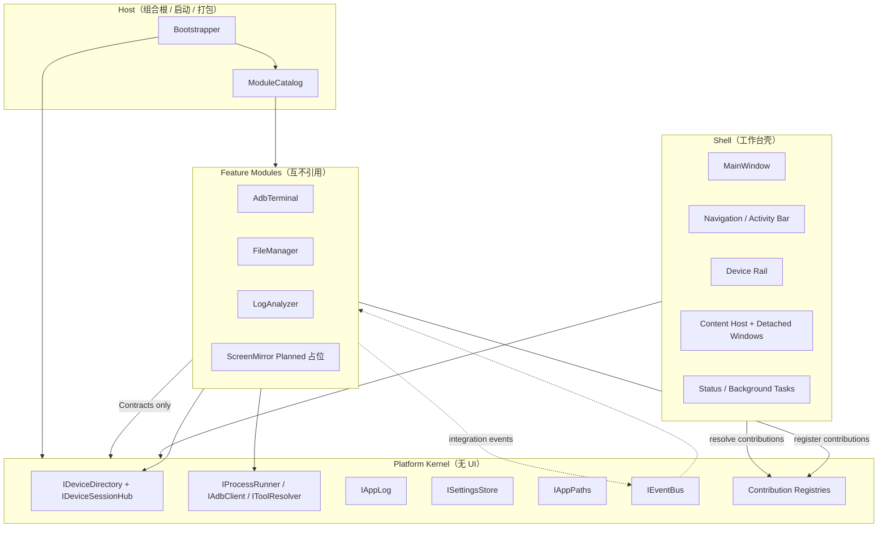
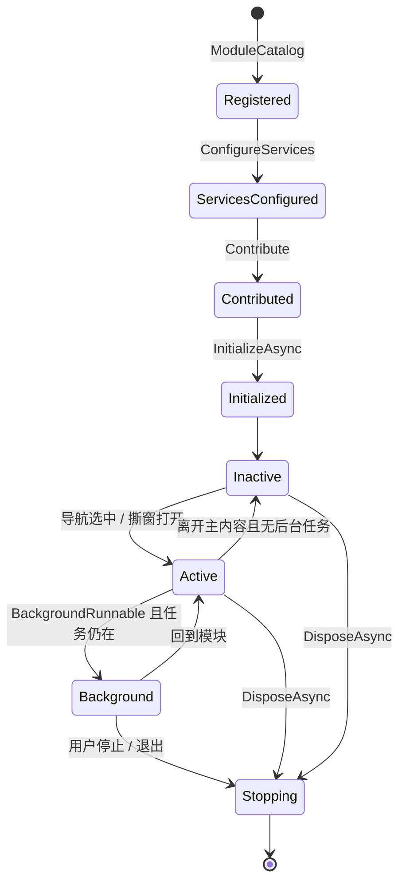
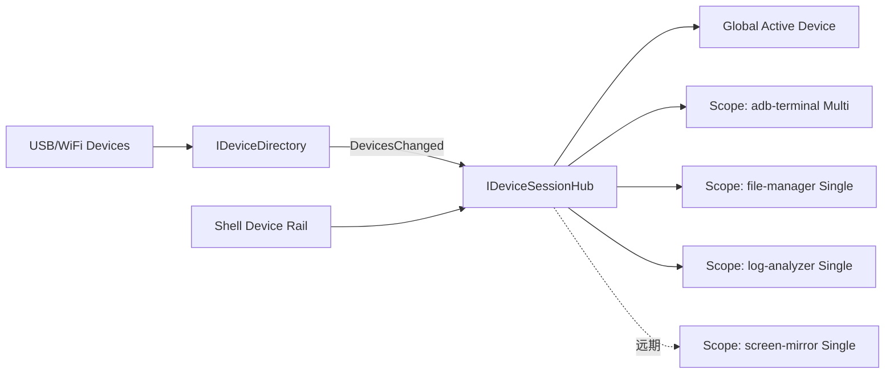
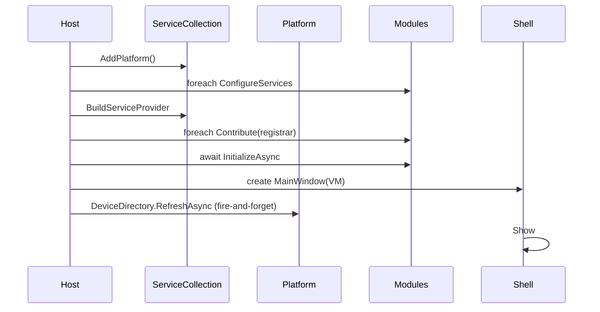

# Yovo ADB Tools — 架构设计 v5（全量重构）

> **状态：** 目标架构（草案，待评审落地）  
> **日期：** 2026-08-11  
> **适用范围：** 不兼容旧代码的全量重构；旧 `FactoryHelper` 单程序集架构仅作问题基线  
> **关联需求：** `docs/requirements/需求分析.md`（重构后需同步修订）  
> **后续模块：** ADB 命令终端、文件管理、日志分析（及未来产测扩展）  
> **投屏显示：** 仅导航预留（`screen-mirror` / Planned），**本期不做实现**；平台可保留长进程能力切口，但不交付 scrcpy 工具链与模块代码

---

## 0. 一句话结论

把「单程序集 + 四个平台服务 + `CreateView()→UserControl`」升级为 **Host / Platform Kernel / Feature Modules** 的模块化单体（Modular Monolith）：  
平台只提供设备会话、进程能力、工具链、导航贡献点与消息总线；每个业务模块自持领域与数据，通过契约扩展 Shell，互不引用实现。  
投屏（`screen-mirror`）本期仅 Planned 占位，不建模块、不嵌入 scrcpy。

---

## 1. 重构动机与目标

### 1.1 产品定位变化

| 维度 | v4（现状） | v5（目标） |
|------|-----------|-----------|
| 产品形态 | ADB 命令终端 + 占位入口 | **设备工具工作台（Workbench）** |
| 模块数 | 1 个真实 + 3 个占位 | 3 个实现模块（终端/文件/日志）+ 投屏 Planned 占位 |
| 设备使用方式 | 全局多选、并行发命令 | **设备目录 + 模块焦点**（多选/单选按模块声明） |
| 进程模型 | 短命令全缓冲 | 短命令 / 流式 / 长驻 / 外置工具并存 |
| UI 组合 | 单 Content 切换 | 主内容区 + 可撕出窗口 + 后台运行指示 |
| 扩展方式 | `App.xaml.cs` 手工 `Register` | 模块清单 + 贡献点注册 + DI |

### 1.2 架构目标（必须满足）

1. **边界清晰：** 平台 / Shell / 模块三层职责无歧义；模块间零实现依赖。  
2. **可拓展：** 新增模块不改平台内核；仅增加模块项目并登记清单。  
3. **能力完备：** 覆盖文件管理（push/pull+进度）、日志分析（流式 logcat）；投屏仅占位，实现排期外。  
4. **可测试：** 核心领域与平台服务可单测；架构边界可用架构测试强制。  
5. **轻量运维：** 仍保持单 exe 自包含发布；不引入微服务/多进程插件宿主（除非未来证明必要）。  
6. **产线友好：** 浅色 UI、低资源、无管理员权限、数据落 `%LOCALAPPDATA%`。

### 1.3 非目标（明确不做）

- 不做 VS Code 级 Extension Host 多进程隔离（复杂度过高，收益不匹配产线工具）。  
- 不做运行时热插拔第三方 DLL 插件市场。  
- 不做 MES/云端（仅预留接口位置）。  
- 不做跨平台（锁定 Windows x64 + WPF）。  
- **不兼容** v4 代码结构、命名空间、模块契约与设置文件布局（允许迁移脚本，但不保留旧 API）。

---

## 2. 现状诊断（审查基线）

> 基于 `src/FactoryHelper` 现实现（单项目、约 40 个源文件）。旧架构文档目录为空；以代码与 `CLAUDE.md` / 需求文档为准。

### 2.1 当前结构（事实）

```
App.xaml.cs（组合根，手工 new）
 ├─ Platform: Settings / AppPaths / AdbProcess / Device / Log
 ├─ ModuleRegistry + AdbTerminalModule
 └─ Shell: DevicePanel + Settings + NavModuleItem → 单 ContentControl
```

关键契约：

```csharp
// 现状 IModule —— 能力过窄且 UI 耦合
public interface IModule {
    string Id { get; }
    string Title { get; }
    string IconGlyph { get; }
    int SortOrder { get; }
    void Initialize(IModuleContext context);
    UserControl CreateView(); // ← Core 直接依赖 WPF
}
```

平台上下文仅暴露：`Adb` / `Devices` / `Log` / `Settings` / `Paths`。

### 2.2 做得好的部分（应保留思想）

| 点 | 说明 |
|----|------|
| 模块业务自持 | `AdbTerminal` 的 Repository/Execution/Evaluator 不进平台 |
| ADB 成败分离 | `AdbProcessService` 不判定成败；判定在模块领域 |
| 设备快照不可变 | `AdbDevice` record + 事件，服务层不暴露 UI 集合 |
| 编辑即快照 | 命令管理深拷贝编辑、全量提交 |
| 导航-内容框架 | Shell 统一承载模块入口的方向正确 |
| 嵌入 ADB | 单文件发布对产线友好 |

### 2.3 致命缺口（阻塞后续三模块）

| # | 缺口 | 影响模块 | 现状证据 |
|---|------|----------|----------|
| P1 | ADB 仅 `RunAsync` 全缓冲短命令 | 文件管理、日志分析 | `AdbProcessService.RunAsync` + `ReadToEndAsync` |
| P2 | 无长驻/外置进程抽象 | 投屏 | 超时 `Kill(true)`；无 scrcpy 宿主 |
| P3 | 无模块生命周期（Activate/Deactivate/Dispose） | 投屏、logcat | `IModule` 仅 Initialize/CreateView |
| P4 | 全局唯一设备多选会话 | 全部 | `IDeviceService.SelectedDevices` 一份 |
| P5 | 单 Content 面板，无法撕窗/后台指示 | 投屏 | `ShellViewModel.CurrentView` |
| P6 | 零跨模块通信 | 协同场景 | 无事件总线/契约调用 |
| P7 | Core 绑定 WPF `UserControl` | 测试/边界 | `IModule.CreateView` |
| P8 | 单程序集、无 DI 容器、无测试项目 | 扩展与回归 | 仅 `FactoryHelper.csproj` |
| P9 | `ILogService` = 应用操作日志 | 日志分析误用风险 | 无 serial/tag/pid；不可查询历史 |
| P10 | Paths/Settings 对多工具扩展不足 | 投屏工具链 | 仅 `adb.path` + `data.dir` |

### 2.4 文档与实现漂移

- `CLAUDE.md` 写日志「后台批量落盘 + 5MB 轮转」，代码与需求均为**仅内存不落盘**。  
- `docs/architecture/` 在仓库中为空，却被多处引用。  
- 预留模块 Id（`screen-mirror` / `file-manager` / `log-analyzer`）已在 `App.xaml.cs` 声明，但平台能力未准备。

**诊断结论：** v4 对「单一命令终端」是合理的小型 MVVM；对「多能力工作台」则平台内核过薄、模块契约过浅、设备/进程模型错误抽象层级。需要**换架构，而不是在旧契约上打补丁**。

---

## 3. 业界参考与取舍

### 3.1 参考来源

| 来源 | 关键思想 | 对本项目的适用性 |
|------|----------|------------------|
| [Prism Modules](https://prismlibrary.github.io/docs/modules.html) | ModuleCatalog、模块初始化顺序、Region、松耦合通信 | **采纳思想**：模块目录、初始化、区域贡献；**不引入完整 Prism**（体积与学习成本偏高） |
| [Plugin Architecture in C#](https://www.devleader.ca/2026/04/07/plugin-architecture-in-c-the-complete-guide-to-extensible-net-applications) | Contract / Host / Implementation 三分；契约最小化 | **完全采纳** |
| [Modular Monolith (.NET)](https://milanjovanovic.tech/blog/modular-monolith-architecture-dotnet) | 单部署单元 + 显式边界 + Contracts + 集成事件 | **主范式** |
| [Kamil Grzybek — Domain-Centric Modular Monolith](https://www.kamilgrzybek.com/blog/posts/modular-monolith-domain-centric-design) | 每模块当子系统；同步 Facade + 异步 Events | **采纳通信模型** |
| [VS Code Contribution Points](https://code.visualstudio.com/api/references/contribution-points) | 声明式贡献（views/commands/configuration） | **轻量采纳**：模块清单声明导航/命令/设置页 |
| [scrcpy 架构](https://github.com/Genymobile/scrcpy/blob/master/doc/develop.md) | Client/Server、多 socket、会话 ID、ADB tunnel | **远期参考**（投屏本期不做）；不进平台内核 |

### 3.2 明确取舍

| 选项 | 决策 | 理由 |
|------|------|------|
| 微服务 | ❌ | 产线单机工具，运维成本不可接受 |
| 完整 Prism | ❌ | 我们需要的是边界与贡献点，不是整套 Region 框架 |
| MEF / 目录热加载插件 | ❌ 现阶段 | 内置模块静态组合即可；预留目录加载扩展点 |
| AssemblyLoadContext 隔离 | ❌ 现阶段 | 同进程共享依赖更简单；模块可信（第一方） |
| 模块化单体 + 多项目 | ✅ | 边界可编译强制，部署仍单 exe |
| Microsoft.Extensions.DependencyInjection | ✅ | 标准、轻量、可测 |
| 自研轻量 EventBus（进程内） | ✅ | 跨模块解耦够用，无需 MassTransit |
| WPF-UI + CommunityToolkit.Mvvm | ✅ 保留 | 与现 UI 方向一致 |

---

## 4. 目标架构总览

### 4.1 逻辑视图



### 4.2 物理部署视图

```
YovoAdbTools.exe          ← 单文件自包含
 ├─ 内嵌 adb.exe + DLL
 └─ 运行时数据
     %LOCALAPPDATA%\YovoAdbTools\
       ├─ settings\app.json          ← 平台设置（固定根，不随数据目录迁移）
       ├─ data\                      ← 可配置数据根（默认同级）
       │   ├─ modules\
       │   │   ├─ adb-terminal\
       │   │   ├─ file-manager\
       │   │   └─ log-analyzer\
       │   ├─ tools\                 ← 解压的 adb（scrcpy 等远期工具预留子目录约定）
       │   ├─ cache\
       │   └─ temp\
       └─ logs\（可选，默认关闭；分析会话导出另存）
```

### 4.3 核心原则（硬约束）

1. **依赖单向：**  
   `Host → Shell → Modules → Platform.Abstractions`  
   `Shell → Platform`  
   `Modules ✗→ Modules`（禁止）  
   `Platform.Abstractions` 不含 WPF 类型。  
2. **共享内核极瘦：** 只放跨模块真正共享的原语（DeviceId、Result、事件基类），禁止「万能 Utils」。  
3. **模块数据私有：** 每模块独立目录与设置命名空间；禁止读写他模块文件。  
4. **同步调用走 Facade，异步反应走 Event：** 需要返回值用契约接口；通知/联动用集成事件。  
5. **UI 是适配器：** ViewModel/服务可无头测试；模块通过 `IViewFactory` 贡献视图，不把 `UserControl` 写进平台契约。  
6. **能力按接口切片演进：** ADB 客户端拆 `IAdbCommand` / `IAdbStreaming` / `IAdbTransfer` / `IAdbTunnel`，模块只依赖所需切片。

---

## 5. 解决方案结构（多项目）

### 5.1 建议仓库布局

```
Yovo-Windows-ADBTools/
├── docs/
│   ├── architecture/
│   │   ├── 架构设计-v5.md              ← 本文
│   │   ├── adr/                        ← 架构决策记录
│   │   └── module-specs/               ← 各模块规格
│   └── requirements/
├── src/
│   ├── Yovo.Host/                      ← 启动、单文件发布、嵌入资源清单
│   ├── Yovo.Shell/                     ← MainWindow、导航、设备栏、状态栏
│   ├── Yovo.Platform.Abstractions/      ← 全部平台接口 + DTO + 事件（无 WPF）
│   ├── Yovo.Platform/                  ← 平台实现（进程/ADB/设置/路径/总线）
│   ├── Yovo.Shared.Kernel/             ← 极瘦共享原语（可选，严格控制体积）
│   └── Modules/
│       ├── Yovo.Modules.AdbTerminal/
│       ├── Yovo.Modules.FileManager/
│       ├── Yovo.Modules.LogAnalyzer/
│       └── （远期）Yovo.Modules.ScreenMirror/   ← 本期不存在；仅 Catalog 占位
├── tests/
│   ├── Yovo.Platform.Tests/
│   ├── Yovo.Modules.AdbTerminal.Tests/
│   ├── Yovo.Architecture.Tests/        ← NetArchTest / 依赖规则
│   └── Yovo.UI.Smoke/                  ← 可选 UIAutomation
└── YovoAdbTools.sln
```

### 5.2 项目引用矩阵（编译期强制）

| 项目 | 允许引用 | 禁止引用 |
|------|----------|----------|
| Host | Shell, Platform, 全部 Modules, Abstractions | — |
| Shell | Platform.Abstractions, Platform（实现仅用于组装时可改为 Host 注入） | Modules.* 实现类型 |
| Platform | Platform.Abstractions, Shared.Kernel | Shell, Modules, WPF |
| Platform.Abstractions | Shared.Kernel（可选） | 一切实现、WPF |
| Module.* | Platform.Abstractions, Shared.Kernel, 本模块内 | 其他 Module.*, Shell, Platform 实现 |
| Tests.* | 被测项目 + 测试库 | 随意跨层 |

> **Shell 不直接 `new` 模块 View：** 只消费 `INavigationContribution` 等注册表。模块程序集由 Host 加载并调用 `IModule.ConfigureServices` / `Contribute`。

### 5.3 命名空间约定

```
Yovo.Platform.Abstractions.Devices
Yovo.Platform.Abstractions.Process
Yovo.Platform.Abstractions.Adb
Yovo.Platform.Abstractions.Tools
Yovo.Platform.Abstractions.Messaging
Yovo.Platform.Abstractions.Composition
Yovo.Platform.Abstractions.Logging
Yovo.Platform.Abstractions.Settings

Yovo.Modules.AdbTerminal.*
Yovo.Modules.FileManager.*
Yovo.Modules.LogAnalyzer.*
# Yovo.Modules.ScreenMirror.*  ← 远期，本期不建

Yovo.Shell.*
Yovo.Host
```

产品显示名仍为 **Yovo ADB Tools**；程序集前缀统一 `Yovo.*`（替换现 `FactoryHelper`）。

---

## 6. 分层与依赖规则

### 6.1 模块内部标准切片（每个模块内部可再分层）

```
Modules/<Name>/
  <Name>Module.cs                 ← IModule 实现：DI 注册 + 贡献点
  Contracts/                      ← 仅当需要被他模块同步调用时存在（默认不建）
  Application/                    ← 用例 / 编排（ViewModel 可直接用，或经 Mediator）
  Domain/                         ← 纯领域模型与规则（无 IO、无 WPF）
  Infrastructure/                 ← 文件/JSON/调用平台端口的适配器
  Presentation/
    ViewModels/
    Views/
  Resources/                      ← 默认配置、图标等嵌入资源
```

规则：

- `Domain` 不引用 Platform 实现，只可引用 Abstractions 中的值对象（或完全不引用）。  
- `Presentation` → `Application/Domain`；禁止 View code-behind 调 Infrastructure。  
- 默认 **不** 为每个模块建 Contracts 项目；仅当出现「模块 A 同步需要模块 B」时再抽 `Yovo.Modules.<B>.Contracts`。

### 6.2 架构测试（强制规则示例）

使用 NetArchTest / ArchUnitNET，CI 失败即构建失败：

1. `Modules.*` 不得引用 `Modules.*(其他)`。  
2. `Platform.Abstractions` 不得引用 `System.Windows`。  
3. `Platform` 不得引用 `Shell` / `Modules`。  
4. 仅 `Host` 可引用全部模块程序集。  
5. 领域命名空间不得引用 `Infrastructure` / `Views`。

---

## 7. 平台内核（Platform Kernel）详细设计

平台内核是**无 UI 的能力中枢**。以下按子系统拆分。

### 7.1 子系统清单

| 子系统 | 接口前缀 | 职责 |
|--------|----------|------|
| 路径 | `IAppPaths` | 数据根、模块目录、工具目录、缓存、临时目录 |
| 设置 | `ISettingsStore` | 分 scope 的强类型/JSON 设置，原子写，版本迁移 |
| 应用日志 | `IAppLog` | UI 操作日志（内存环形缓冲 + 可选订阅） |
| 设备目录 | `IDeviceDirectory` | 扫描/缓存设备列表（不含「选择」） |
| 设备会话 | `IDeviceSessionHub` | 全局焦点 + 每模块选择作用域 |
| 进程运行器 | `IProcessRunner` | 通用进程：短跑/流式/长驻/杀进程树 |
| ADB 客户端 | `IAdbClient`（多切片） | 命令、流、传输、隧道 |
| 工具解析 | `IToolResolver` | adb 等工具路径解析与解压（`ToolId` 可扩展，scrcpy 远期） |
| 事件总线 | `IEventBus` | 进程内发布/订阅集成事件 |
| 后台任务 | `IBackgroundTaskCenter` | 长任务登记、取消、状态栏展示 |
| 贡献注册表 | `IContributionRegistry` | 导航/命令/设置页/状态项 |

### 7.2 `IAppPaths`

```csharp
public interface IAppPaths
{
    string SettingsRoot { get; }          // 固定：%LOCALAPPDATA%\YovoAdbTools\settings
    string DataRoot { get; }              // 可配置，重启或热切换策略见 ADR
    string ToolsRoot { get; }             // DataRoot/tools
    string CacheRoot { get; }
    string TempRoot { get; }
    string ModuleData(string moduleId);   // DataRoot/modules/{moduleId}
    string ModuleConfig(string moduleId); // ModuleData/config
}
```

约定：

- **SettingsRoot 永不跟随 DataRoot**（避免循环依赖）。  
- 模块禁止写 SettingsRoot 以外的兄弟模块目录。  
- `TempRoot` 启动时可清理过期文件。

### 7.3 `ISettingsStore`

```csharp
public interface ISettingsStore
{
    T Get<T>(SettingsScope scope, string key, T defaultValue);
    void Set<T>(SettingsScope scope, string key, T value);
    IObservable<SettingsChanged> Watch(SettingsScope scope, string? key = null);
    void Migrate(SettingsScope scope, int fromVersion, int toVersion, Action<ISettingsMigration> migrate);
}

public enum SettingsScopeKind { App, Module }
public readonly record struct SettingsScope(SettingsScopeKind Kind, string Id);
// App: Id="app"；Module: Id=moduleId
```

相对现状改进：

- 去掉「Dictionary&lt;string,string&gt; 套一层 JSON」的双序列化，改为**每 scope 一个 JSON 文档 + schema version**。  
- 支持迁移回调。  
- 平台键：`adb.path`、`data.root`、`ui.theme`、`devices.autoRefresh` 等（`tools.scrcpy.path` 等投屏相关键远期再加）。

### 7.4 `IAppLog`（原 LogService 重定位）

**仅表示应用/模块操作日志**，绝不承载设备 logcat。

```csharp
public interface IAppLog
{
    void Write(AppLogLevel level, string message, string source, IReadOnlyDictionary<string, string>? tags = null);
    IDisposable Subscribe(AppLogFilter filter, Action<AppLogEntry> handler);
    IReadOnlyList<AppLogEntry> Snapshot(AppLogFilter? filter = null, int max = 2000);
}

public sealed record AppLogEntry(
    DateTimeOffset Timestamp,
    AppLogLevel Level,
    string Message,
    string Source,
    IReadOnlyDictionary<string, string> Tags);
```

改进点：迟到订阅可 `Snapshot`；支持 tags（如 `serial`）；默认内存环形缓冲（可配置容量）；**默认不落盘**（与产线需求一致），设置中可开「调试落盘」。

### 7.5 进程子系统（最关键升级）

```csharp
public interface IProcessRunner
{
    Task<ProcessResult> RunAsync(ProcessSpec spec, CancellationToken ct = default);

    Task<IStreamingProcess> StartStreamingAsync(ProcessSpec spec, CancellationToken ct = default);

    Task<ILongRunningProcess> StartLongRunningAsync(ProcessSpec spec, CancellationToken ct = default);
}

public sealed record ProcessSpec(
    string FileName,
    string Arguments,
    string? WorkingDirectory = null,
    IReadOnlyDictionary<string, string>? Environment = null,
    Encoding? StdOutEncoding = null,
    Encoding? StdErrEncoding = null,
    TimeSpan? Timeout = null,                 // 仅对 RunAsync 有意义；长驻必须 null
    bool KillTreeOnCancel = true);

public interface IStreamingProcess : IAsyncDisposable
{
    IAsyncEnumerable<ProcessOutputChunk> Output { get; }
    Task<int> WaitForExitAsync(CancellationToken ct = default);
    void Kill();
}

public interface ILongRunningProcess : IAsyncDisposable
{
    int Id { get; }
    bool IsRunning { get; }
    event EventHandler? Exited;
    Task WaitForExitAsync(CancellationToken ct = default);
    void Kill();
}
```

规则：

- **短命令**用 `RunAsync`（可超时）。  
- **logcat / 大输出**用 `StartStreamingAsync`。  
- **长驻进程**用 `StartLongRunningAsync`（禁止默认超时）——本期主要为架构切口；投屏落地前可不接真实业务。  
- 取消语义统一：`KillTreeOnCancel` 默认 true。  
- 全局限流：可选 `IAdbServerGate`（信号量）防止打爆 adb server。

### 7.6 ADB 客户端（接口切片）

```csharp
public interface IAdbClient :
    IAdbCommandExecutor,
    IAdbStreamingExecutor,
    IAdbTransfer,
    IAdbTunnel
{ }

public interface IAdbCommandExecutor
{
    Task<AdbTextResult> ExecuteAsync(DeviceSerial? serial, string adbArgs, TimeSpan? timeout = null, CancellationToken ct = default);
}

public interface IAdbStreamingExecutor
{
    Task<IStreamingProcess> ExecuteStreamingAsync(DeviceSerial? serial, string adbArgs, CancellationToken ct = default);
}

public interface IAdbTransfer
{
    Task PushAsync(DeviceSerial serial, string localPath, string remotePath, IProgress<TransferProgress>? progress = null, CancellationToken ct = default);
    Task PullAsync(DeviceSerial serial, string remotePath, string localPath, IProgress<TransferProgress>? progress = null, CancellationToken ct = default);
}

public interface IAdbTunnel
{
    Task<IDisposable> ForwardAsync(DeviceSerial serial, string local, string remote, CancellationToken ct = default);
    Task<IDisposable> ReverseAsync(DeviceSerial serial, string remote, string local, CancellationToken ct = default);
}
```

说明：

- `DeviceSerial` 为值对象，禁止裸 `string` 满天飞。  
- `ExecuteAsync` 的 `adbArgs` **不含** `adb` 自身路径，由 `IToolResolver` 注入。  
- 模块需要哪片能力就注入哪片接口（ISP）。  
- **成败判定永远不在 ADB 客户端内**（延续 v4 正确决策）。

### 7.7 `IToolResolver`

```csharp
public interface IToolResolver
{
    ToolPath Resolve(ToolId tool);           // Adb, Scrcpy, ...
    Task EnsureExtractedAsync(ToolId tool, CancellationToken ct = default);
    void Refresh();                          // 设置变更后
}

public enum ToolId { Adb /* , Scrcpy — 远期 */ }
public sealed record ToolPath(string ExePath, string HomeDirectory, bool IsAvailable);
```

解析顺序（可配置）：

1. 用户设置覆盖  
2. 应用旁 `tools/`（开发）  
3. 嵌入资源 → `DataRoot/tools/{tool}/`  
4. 系统 PATH（可选，默认关闭，保证产线可复现）

本期只实现并嵌入 **Adb**；`ToolId` 枚举保持可扩展，不为投屏预埋设置项或嵌入资源。

### 7.8 `IBackgroundTaskCenter`

大文件传输、持续抓 log 必须在 Shell 状态栏可见（投屏远期同样复用此机制）：

```csharp
public interface IBackgroundTaskCenter
{
    BackgroundTaskId Register(BackgroundTaskDescriptor descriptor);
    void Update(BackgroundTaskId id, BackgroundTaskState state);
    void Complete(BackgroundTaskId id, BackgroundTaskCompletion completion);
    IReadOnlyList<BackgroundTaskSnapshot> Active { get; }
    event Action? Changed;
}
```

模块启动长任务时必须登记；Shell 渲染「后台任务」托盘/状态条；应用退出前询问或自动取消。

---

## 8. 模块系统与贡献点

### 8.1 模块契约（替换 `IModule`）

```csharp
public interface IModule
{
    ModuleDescriptor Descriptor { get; }

    /// <summary>向 DI 注册本模块服务（可多次调用安全）</summary>
    void ConfigureServices(IServiceCollection services, IModuleHostContext host);

    /// <summary>从 DI 解析后登记贡献点（导航、命令、设置页等）</summary>
    void Contribute(IContributionRegistrar registrar, IServiceProvider services);

    /// <summary>可选：模块级启动（加载库、预热），允许异步</summary>
    Task InitializeAsync(IServiceProvider services, CancellationToken ct);

    /// <summary>应用退出或模块禁用时</summary>
    ValueTask DisposeAsync();
}

public sealed record ModuleDescriptor(
    string Id,                    // 稳定 Id：adb-terminal / screen-mirror / ...
    string Title,
    string IconGlyph,
    int SortOrder,
    ModuleCapability Capabilities,
    DeviceSelectionMode DeviceSelectionMode,
    bool IsPlanned = false);      // 占位模块也可是真实 IModule 实现

[Flags]
public enum ModuleCapability
{
    None = 0,
    MainView = 1,
    DetachedWindow = 2,
    BackgroundRunnable = 4,
    RequiresExternalTool = 8,
    SingleDevicePreferred = 16,
    MultiDeviceSupported = 32,
}

public enum DeviceSelectionMode
{
    None,                 // 不消费设备（纯设置类）
    SingleRequired,       // 必须一台
    SingleOptional,
    MultiOptional,        // 终端：多选并行
    MultiRequired
}
```

### 8.2 贡献点模型（借鉴 VS Code，落地为强类型注册）

```csharp
public interface IContributionRegistrar
{
    void Navigation(NavigationContribution contrib);
    void Command(CommandContribution contrib);
    void SettingsPage(SettingsPageContribution contrib);
    void StatusItem(StatusItemContribution contrib);
    void DeviceContextAction(DeviceActionContribution contrib); // 设备右键/更多
}

public sealed record NavigationContribution(
    string ModuleId,
    string Title,
    string IconGlyph,
    int SortOrder,
    Func<IServiceProvider, object> ViewModelFactory,   // 非 UI 类型
    string ViewKey);                                    // 映射到 DataTemplate / ViewLocator
```

原则：

- **贡献清单可在 Initialize 前用于构建导航**（元数据来自 `ModuleDescriptor`，不必跑 View）。  
- View 通过 `ViewKey` + Shell 的 `IViewLocator` 解析，**平台/契约层永不出现 `UserControl`**。  
- 设置页也是贡献点，不再写死在 Shell。

### 8.3 模块生命周期



Shell 必须调用：

- `OnActivatedAsync` / `OnDeactivatedAsync`（可由模块实现可选接口 `IModuleActivation`）  
- 退出前遍历 `IBackgroundTaskCenter` + 各模块 `DisposeAsync`

### 8.4 ModuleCatalog

```csharp
// Host 内静态清单（第一阶段）；未来可改目录扫描
public static class ModuleCatalog
{
    public static IReadOnlyList<IModule> CreateAll() =>
    [
        new AdbTerminalModule(),
        new FileManagerModule(),
        new LogAnalyzerModule(),
        new PlannedModule("screen-mirror", "投屏显示", "", sortOrder: 50), // 仅占位，无业务
    ];
}
```

占位不再是 Shell 特殊类型散落逻辑，而是 **`IsPlanned=true` 的轻量 `IModule`（如通用 `PlannedModule`）**：只贡献导航与「开发中」页，**不** `ConfigureServices` 业务、不建模块项目。投屏在取消预留、真正开发前，保持此形态。

---

## 9. 设备会话模型（关键重构）

### 9.1 问题重述

v4 把「设备目录」与「用户选择」揉在一个 `IDeviceService`，且全局多选。  
终端需要多选并行；投屏/文件/日志通常需要**当前焦点设备**。全局一份选择会导致模块互相踩踏。

### 9.2 目标模型



```csharp
public interface IDeviceDirectory
{
    IReadOnlyList<AdbDevice> Devices { get; }
    event Action? DevicesChanged;
    Task RefreshAsync(CancellationToken ct = default);
    // 可选：StartWatchAsync / StopWatchAsync（轮询或 WMI/USB 通知，二期）
}

public interface IDeviceSessionHub
{
    /// <summary>全局焦点设备（设备栏高亮；单设备模块默认跟随）</summary>
    AdbDevice? ActiveDevice { get; }
    void SetActiveDevice(DeviceSerial? serial);

    /// <summary>按模块作用域读写选择</summary>
    DeviceSelection GetSelection(string moduleId);
    void SetSelection(string moduleId, DeviceSelection selection);

    event Action<string /*moduleId*/>? SelectionChanged;
    event Action? ActiveDeviceChanged;
}

public sealed record DeviceSelection(
    DeviceSelectionMode Mode,
    IReadOnlyList<DeviceSerial> Serials);
```

### 9.3 Shell 设备栏交互规则

| 用户操作 | 效果 |
|----------|------|
| 单击设备 | 设为 `ActiveDevice`；当前模块若为 Single* 则同步其 scope |
| Ctrl/扩展多选 | 仅当当前模块 `Multi*` 时写入该模块 scope；否则提示「当前模块仅支持单设备」 |
| 刷新 | 更新目录；各 scope 按 serial 保活过滤；Active 若掉线则清空并广播 `DeviceLost` |
| 设备掉线事件 | `IEventBus.Publish(new DeviceOffline(serial))`；logcat 等模块自行停止 |

### 9.4 设备占用（可选一期后做）

```csharp
public interface IDeviceLeaseService
{
    Task<IDeviceLease?> TryAcquireAsync(DeviceSerial serial, string ownerModuleId, string reason, CancellationToken ct = default);
}

// 集成事件
public sealed record DeviceLeaseChanged(DeviceSerial Serial, string? OwnerModuleId, string? Reason);
```

远期模块（如投屏）获得 lease 后，终端仍可发命令（默认不硬锁），但 UI 显示「占用中」；硬锁策略做成设置项。本期无占用方也可先实现 Hub API。

---

## 10. 进程与 ADB 能力面（按模块需求映射）

| 能力 | API | 终端 | 文件 | 日志 | 投屏（远期） |
|------|-----|------|------|------|-------------|
| 短命令 | `IAdbCommandExecutor` | ✅ | ✅（ls/rm…） | ✅（少量） | ✅（辅助） |
| 流式 | `IAdbStreamingExecutor` | △ | △ | ✅ 核心 | △ |
| Push/Pull | `IAdbTransfer` | △ | ✅ 核心 | △（导出） | △ |
| Forward/Reverse | `IAdbTunnel` | — | — | — | 按实现需要 |
| 外置长驻进程 | `IProcessRunner.StartLongRunning` | — | — | — | ✅（预留 API） |
| 后台任务登记 | `IBackgroundTaskCenter` | △ | ✅ | ✅ | ✅ |

> △ = 可用但不阻塞 MVP。投屏列仅表示远期映射，**本期无实现、无验收。**

### 10.1 并发与 adb server

- 平台提供 `IAdbConcurrencyLimiter`（默认并行度 4，可设置）。  
- `devices` 刷新与传输共享限流。  
- 长驻进程（远期投屏等）不占用短命令信号量（或占用独立槽位）。

### 10.2 取消与超时矩阵

| API | Timeout | Cancel |
|-----|---------|--------|
| Run/Execute | 有默认（如 30s），可覆盖 | Kill tree |
| Streaming | 无默认超时 | Cancel = Kill |
| LongRunning | **禁止**超时 | 显式 Stop/Kill |
| Transfer | 可按文件大小估算或无超时 + 可取消 | Cancel = Kill adb |

---

## 11. 模块间通信

### 11.1 原则

1. **默认不通信。**  
2. 需要「通知」→ `IEventBus` 集成事件（可有多个订阅者）。  
3. 需要「请求/响应」→ 在被调用方模块建 `Contracts` 程序集 + Facade；调用方依赖 Contracts。  
4. **禁止**通过静态事件、共享可变单例、直接拿其他模块 ViewModel。

### 11.2 `IEventBus`

```csharp
public interface IEventBus
{
    void Publish<T>(T message) where T : IIntegrationEvent;
    IDisposable Subscribe<T>(Action<T> handler) where T : IIntegrationEvent;
    IDisposable Subscribe<T>(Func<T, Task> handler) where T : IIntegrationEvent;
}
```

首批集成事件：

| 事件 | 发布方 | 典型订阅方 |
|------|--------|------------|
| `DevicesRefreshed` | Platform | Shell、各模块 |
| `DeviceOffline` | Platform | LogAnalyzer（及远期投屏等） |
| `ActiveDeviceChanged` | Platform | 单设备模块 |
| `BackgroundTaskChanged` | Platform | Shell 状态栏 |
| `LibraryChanged` | AdbTerminal | （仅模块内也可不用总线） |
| `LogCaptureStarted/Stopped` | LogAnalyzer | Shell |
| （远期）`MirrorSessionStarted/Stopped` | ScreenMirror | Shell、DeviceLease |
| `TransferProgress` | FileManager | （模块内优先；跨模块才上总线） |

### 11.3 UI 线程编组

- 总线**默认在发布线程回调**。  
- Shell/ViewModel 使用 `IUiDispatcher`（抽象）编组：  
  `IUiDispatcher.Post(Action)` / `InvokeAsync`。  
- Platform 不引用 WPF Dispatcher；Host 注册实现。

---

## 12. Shell 与 UI 组合

### 12.1 工作台布局

```
┌──────────────────────────────────────────────────────────────┐
│ Title Bar（WPF-UI）                                           │
├────────────┬─────────────────────────────────────────────────┤
│ Activity   │  Content Host                                   │
│ Bar        │  ┌────────────────────────────────────────────┐ │
│ (模块导航) │  │ 当前模块主视图（DataTemplate）               │ │
│            │  └────────────────────────────────────────────┘ │
│            ├─────────────────────────────────────────────────┤
│ Device     │  可选：底部面板（日志/传输队列）— 二期           │
│ Rail       │                                                 │
├────────────┴─────────────────────────────────────────────────┤
│ Status Bar：后台任务 / ADB 状态 / ActiveDevice                 │
└──────────────────────────────────────────────────────────────┘
```

### 12.2 视图解析

```csharp
public interface IViewLocator
{
    FrameworkElement Resolve(string viewKey, object viewModel);
}
```

- 模块在本程序集注册 `viewKey → View type`（Host/Shell 汇总）。  
- ViewModel 保持单例或 Scoped：  
  - **主视图 ViewModel：** 模块级单例（切换导航不丢状态）。  
  - **撕出窗口：** 预留能力（命令管理窗等已需要）；远期投屏可「一设备一会话」。

### 12.3 撕出窗口与后台

| 模式 | 适用 | 行为 |
|------|------|------|
| 嵌入 Content Host | 终端、文件、日志、设置 | 导航切换替换内容 |
| Detached Window | 命令管理等对话框/工具窗；远期投屏控制面板 | `IWindowService.Open(...)` |
| Background without UI | logcat 抓取、传输 | 仅状态栏；可点开回到模块 |

`IWindowService` 提升为 **Platform.Abstractions 的 UI 端口**（由 Shell 实现），不再藏在 AdbTerminal 模块内。

### 12.4 导航构建算法

1. 读取所有 `ModuleDescriptor`（含 Planned）。  
2. 按 `SortOrder` 排序。  
3. `IsPlanned` 显示「开发中」徽章，点击给占位页。  
4. 设置页来自 `SettingsPageContribution`，不再写死。  
5. 真实模块替换同 Id 占位（Catalog 不应同时存在同 Id）。

---

## 13. 业务模块详细设计

### 13.1 AdbTerminal（迁移自现模块）

**职责：** 命令库、命令组、多设备并行执行、成功判定、命令管理窗口。

**依赖平台：**

- `IAdbCommandExecutor`  
- `IDeviceSessionHub`（`MultiOptional`）  
- `IAppLog`、`ISettingsStore`、`IAppPaths`  
- `IWindowService`（命令管理窗）

**自持：**

- `CommandLibrary` / `CommandRepository`（路径：`ModuleConfig/library.json`）  
- `CommandEvaluator`（FailureRegex → SuccessRegex → ExitCode）  
- `ExecutionService`  
- 编辑即快照语义保持

**UI：** 主视图嵌入；管理器独立窗。

**迁移注意：** 命令库格式可保留 JSON 字段兼容用户数据（**唯一建议兼容点**）；代码 API 不兼容。

---

### 13.2 ScreenMirror（投屏显示）— **本期仅预留**

| 项 | 决策 |
|----|------|
| 状态 | **Planned 占位**，导航显示「开发中」 |
| 代码 | **不建** `Yovo.Modules.ScreenMirror` 项目 |
| 工具链 | **不嵌入** scrcpy；不做路径设置项 |
| 验收 | 无功能验收；仅验证占位入口可点 |

**占位约定：**

- Module Id 固定：`screen-mirror`（与现有 `App.xaml.cs` Planned 一致）  
- 标题：投屏显示；由通用 `PlannedModule` 贡献导航 + 占位页  
- 将来开工时：删除/替换同 Id 占位 → 新建模块项目 → 按下方远期草案实现  

**远期草案（非本期范围，仅防平台设计踩坑）：**

- 倾向托管 scrcpy 外置进程（`StartLongRunning` + 未来 `ToolId.Scrcpy`）  
- `DeviceSelectionMode.SingleRequired` + `BackgroundRunnable`  
- 设备掉线停会话；导航离开可保持后台  
- 详细目录/状态机待立项时另写 `module-specs/screen-mirror.md`

本期平台**不必**为投屏单独交付 `IAdbTunnel` / Scrcpy 解析；`StartLongRunning` 可作为通用切口实现，但无投屏调用方。

---

### 13.3 FileManager（文件管理）

**职责：** 浏览设备文件系统、上传/下载、删除/新建/重命名（MVP 子集可裁剪）。

**依赖平台：**

- `IAdbCommandExecutor`（`shell ls` / `stat` / `rm` / `mkdir`）  
- `IAdbTransfer`（push/pull + 进度）  
- `IDeviceSessionHub`（SingleRequired）  
- `IBackgroundTaskCenter`  
- `IAppPaths.TempRoot`（中转）

**领域模型建议：**

```csharp
public sealed record RemotePath(string Value); // 规范化、禁止空
public sealed record RemoteEntry(string Name, RemotePath Path, bool IsDirectory, long? Size, DateTimeOffset? Modified);
public sealed record TransferJob(Guid Id, TransferDirection Direction, string Local, RemotePath Remote, DeviceSerial Serial);
```

**关键设计点：**

1. **Listing：** 短命令；注意 quoting 与特殊文件名；可先支持 `/sdcard` 常用根。  
2. **传输队列：** 模块内队列，串行或有限并行；每任务可取消。  
3. **进度：** `IProgress<TransferProgress>` → VM → UI；大文件不走文本 `Output`。  
4. **危险操作：** 删除需确认；根路径白名单/警告。  
5. **与 Windows 本地对话框：** 仅 View 层，不进 Domain。

**不做（MVP）：** 完整权限模型、APK 安装器（可后续）、多设备同时浏览。

---

### 13.4 LogAnalyzer（日志分析）

**职责：** 采集设备 logcat（流式）、过滤、暂停/清空、导出；**不是**应用 `IAppLog` 浏览器。

**依赖平台：**

- `IAdbStreamingExecutor`（`logcat` / `logcat -v threadtime`）  
- `IDeviceSessionHub`（SingleRequired）  
- `IBackgroundTaskCenter`  
- `IAppPaths.ModuleData`（导出会话）

**自持服务：**

```csharp
public interface ILogcatCaptureService
{
    Task StartAsync(DeviceSerial serial, LogcatOptions options, CancellationToken ct = default);
    Task StopAsync();
    IObservable<LogcatLine> Lines { get; }          // 或 Channel Reader
    IReadOnlyList<LogcatLine> BufferSnapshot();
}

public sealed record LogcatLine(
    DateTimeOffset? Timestamp,
    string? Pid,
    string? Tid,
    string? Level,
    string? Tag,
    string Message,
    string Raw);
```

**性能约束：**

- 环形缓冲（默认 50k~200k 行，可设置）。  
- UI 侧节流（如 100ms batch）+ 虚拟化 ListView。  
- 过滤在消费端（tag/level/regex）；高通吐时避免每行 UI 绑定。  
- 导出：过滤结果写模块目录 `exports/`。

**禁止：** 把 logcat 写入 `IAppLog`；禁止用 `RunAsync` 跑无限 logcat。

---

### 13.5 未来模块插槽（平台已预留）

| 模块设想 | 需要的平台能力 | 是否已覆盖 |
|----------|----------------|------------|
| 产测流程编排 | 命令执行 + 结果事件 | ✅（终端可演进或独立模块） |
| APK 安装/卸载 | Transfer + Command | ✅ |
| 性能监控 | Streaming | ✅ |
| MES 对接 | 新 `IMesClient` 端口（空实现） | 预留 Abstractions |

---

## 14. 配置、路径与数据隔离

### 14.1 目录契约

```
{SettingsRoot}/
  app.json                         # version + adb.path + data.root + tools.* + ui.*

{DataRoot}/
  tools/
    adb/
    # scrcpy/          ← 远期
  modules/
    adb-terminal/
      config/library.json
      config/module.json
    file-manager/
      config/bookmarks.json
    log-analyzer/
      config/module.json
      exports/
    # screen-mirror/   ← 远期
  cache/
  temp/
```

### 14.2 设置生效策略

| 键 | 生效 |
|----|------|
| `adb.path` | 立即：`IToolResolver.Refresh()` |
| `data.root` | **重启生效**（简化）；UI 明确提示 |
| 模块内选项 | 立即 |

### 14.3 损坏与备份

延续原子写 + `.bak-时间戳`；模块配置 `version` 字段；迁移失败则备份并回落默认资源。

---

## 15. DI、生命周期与启动流程

### 15.1 启动序列



### 15.2 生命周期 Scope

| 类型 | Lifetime |
|------|----------|
| 平台服务 | Singleton |
| 模块服务（仓储/引擎） | Singleton（随进程）或 Module 级 |
| 主 ViewModel | Singleton per module |
| 对话框 VM | Transient |
| `CancellationToken` 应用退出 | 由 Host 的 `IAppLifetime` 提供 |

### 15.3 组合根伪代码

```csharp
// Yovo.Host/Bootstrapper.cs
var services = new ServiceCollection();
services.AddPlatform();          // 注册全部平台实现
services.AddShell();             // 注册 Shell VM / ViewLocator / WindowService

foreach (var module in ModuleCatalog.CreateAll())
    module.ConfigureServices(services, hostContext);

var sp = services.BuildServiceProvider();
var registrar = sp.GetRequiredService<IContributionRegistrar>();

foreach (var module in modules)
    module.Contribute(registrar, sp);

foreach (var module in modules)
    await module.InitializeAsync(sp, ct);

var main = sp.GetRequiredService<MainWindow>();
main.Show();
```

**删除**现状中「模块自己在 Initialize 里 `new` 全部依赖」的模式；改为 DI 构造注入，便于测试。

---

## 16. 测试策略

### 16.1 金字塔

| 层 | 内容 | 工具 |
|----|------|------|
| 单元 | Evaluator、路径解析、logcat 行解析、命令占位符、设备输出解析 | xUnit |
| 架构 | 依赖规则 | NetArchTest |
| 组件 | `IProcessRunner` 对假进程；Transfer 进度；SessionHub 选择语义 | xUnit + 假实现 |
| 冒烟 | 启动、导航、刷新设备（可选） | 现有 UIAutomation 脚本演进 |

### 16.2 平台端口假实现

为所有 Abstractions 主接口提供 `Yovo.Testing.Fakes`（测试项目内）：

- `FakeAdbClient`（可编排输出/流）  
- `FakeDeviceDirectory`  
- `InMemorySettingsStore`  
- `RecordingEventBus`

模块测试**禁止**启动真实 adb（集成测试标记 `[Trait("Category","Integration")]` 可选）。

---

## 17. 打包与工具链

### 17.1 发布

```bash
dotnet publish src/Yovo.Host -c Release -p:PublishSingleFile=true --self-contained true -r win-x64 -o publish
```

### 17.2 嵌入资源策略

| 资源 | 策略 |
|------|------|
| adb.exe + DLL | 必须嵌入（与现一致） |
| scrcpy | **本期不打包** |
| 模块默认 JSON | 各实现中的模块嵌入自己的 default |

### 17.3 体积控制

- 单文件目标仍面向产线；不引入投屏二进制体积。  
- 禁止把测试/文档打进发布包。

---

## 18. 分阶段落地计划（不兼容旧代码）

> 原则：按「平台能力解锁模块」排序，而非按 UI 完善度。

### Phase 0 — 脚手架（约 0.5~1 周）

- 建立 sln 与项目引用矩阵  
- `AddPlatform` / `ModuleCatalog` / 空 Shell 导航  
- 架构测试绿灯  
- 迁移 ThemeTokens / 基础主窗布局

**退出标准：** 能启动、显示占位导航、无业务。

### Phase 1 — 平台内核 MVP（约 1~2 周）

- Paths / SettingsStore / AppLog  
- ProcessRunner（Run + Streaming；LongRunning 可一并实现作通用切口，无投屏调用方）  
- ToolResolver(Adb) — 不包含 Scrcpy  
- AdbClient：Command + Streaming（Transfer 可放 Phase 3 前补齐）  
- DeviceDirectory + DeviceSessionHub  
- EventBus + UiDispatcher + BackgroundTaskCenter  
- Contribution 导航打通

**退出标准：** 集成测试覆盖 devices 解析、短命令、流式假进程；Shell 可选中设备并切换两个假模块页。

### Phase 2 — AdbTerminal 迁移（约 1 周）

- 搬运领域与 UI，改接新平台  
- 命令库路径迁到 module data  
- 删除 `FactoryHelper` 旧项目

**退出标准：** 现网命令库可用；多设备并行执行与管理窗可用。

### Phase 3 — FileManager MVP（约 1~1.5 周）

- 实现 `IAdbTransfer`  
- 浏览 + 上传下载 + 进度 + 队列

**退出标准：** 大文件可取消；进度可见。

### Phase 4 — LogAnalyzer MVP（约 1 周）

- logcat 流式采集 + 环形缓冲 + 过滤 + 导出  
- 后台任务与设备掉线停止

**退出标准：** 连续抓取 10 分钟 UI 可保持流畅（虚拟化+节流）。

### Phase 5 — 打磨（持续）

- 设备 lease、自动刷新、底部面板、架构文档 ADR 补齐  
- 需求文档与 CLAUDE.md 同步为 v5  
- 投屏占位入口保持「开发中」（**不进入实现排期**）

### 远期（立项后再开）— ScreenMirror

- 新建 `Yovo.Modules.ScreenMirror`，替换 `screen-mirror` 占位  
- ToolResolver(Scrcpy) + LongRunning 业务接入、会话生命周期、可选撕窗  
- 另立规格与排期；不阻塞上述 Phase 0–5

---

## 19. 决策记录（ADR 摘要）

正式 ADR 建议落在 `docs/architecture/adr/`。此处摘要：

| ID | 决策 | 结论 |
|----|------|------|
| ADR-001 | 架构风格 | 模块化单体，多项目，单进程单 exe |
| ADR-002 | DI | Microsoft.Extensions.DependencyInjection |
| ADR-003 | UI 框架 | 继续 WPF + WPF-UI + CommunityToolkit.Mvvm |
| ADR-004 | 模块通信 | 进程内 EventBus + 按需 Contracts Facade |
| ADR-005 | 设备模型 | Directory 与 SessionHub 分离；按模块选择作用域 |
| ADR-006 | 应用日志 vs 设备日志 | 严格分离；LogAnalyzer 自持采集 |
| ADR-007 | 投屏范围 | **本期仅 Planned 占位，不做实现**；远期倾向托管 scrcpy，平台预留长进程切口即可 |
| ADR-008 | 插件热加载 | 不做；ModuleCatalog 静态 |
| ADR-009 | 旧代码兼容 | API/项目结构不兼容；命令库 JSON 尽量可读迁移 |
| ADR-010 | 设置根与数据根 | SettingsRoot 固定；DataRoot 可配且重启生效 |

---

## 20. 关键接口与类型清单（实现清单）

### 20.1 Platform.Abstractions 必须包含

- `IModule` / `ModuleDescriptor` / `IModuleActivation`  
- `IContributionRegistrar` + 各 Contribution 记录类型  
- `IAppPaths` / `ISettingsStore` / `IAppLog`  
- `IProcessRunner` / `IStreamingProcess` / `ILongRunningProcess`  
- `IToolResolver` / `ToolId`  
- `IAdbCommandExecutor` / `IAdbStreamingExecutor` / `IAdbTransfer` / `IAdbTunnel` / `IAdbClient`  
- `IDeviceDirectory` / `IDeviceSessionHub` / `AdbDevice` / `DeviceSerial`  
- `IEventBus` / `IIntegrationEvent`  
- `IBackgroundTaskCenter`  
- `IUiDispatcher` / `IWindowService`  
- `IAppLifecycle`

### 20.2 Shell 必须包含

- `MainWindow` / `ShellViewModel`  
- `DeviceRailViewModel`  
- `StatusBarViewModel`  
- `ViewLocator`  
- `WindowService`  
- `PlannedPlaceholderView`（通用）

### 20.3 Host 必须包含

- `Bootstrapper` / `Program` 或 `App.xaml.cs`  
- `ModuleCatalog`  
- 嵌入资源清单  
- 单文件发布配置

---

## 21. 与 v4 对照（迁移心智模型）

| v4 | v5 |
|----|----|
| `FactoryHelper` 单项目 | `Yovo.*` 多项目模块化单体 |
| `IModuleContext` 五件套 | DI + 细粒度接口切片 |
| `IModule.CreateView(): UserControl` | `Contribute(Navigation)` + `IViewLocator` |
| `IDeviceService` 目录+选择一体 | `IDeviceDirectory` + `IDeviceSessionHub` |
| `AdbProcessService.RunAsync` | `IProcessRunner` + `IAdbClient` 多切片 |
| `ILogService` | `IAppLog` + 模块自持 Logcat |
| `PlannedModule`（Shell 特殊类型） | `ModuleDescriptor.IsPlanned` |
| `App.xaml.cs` 手工 new | `IServiceCollection` 组合根 |
| 模块内 `new WindowService()` | Shell 实现 `IWindowService` 注入 |
| 无后台任务 | `IBackgroundTaskCenter` |
| 无跨模块事件 | `IEventBus` |

---

## 22. 风险与开放问题

| 风险 | 缓解 |
|------|------|
| 流式 UI 性能 | 虚拟化 + batch；架构阶段用假高通吐测试 |
| DataRoot 热切换复杂 | 坚持重启生效 |
| 模块开发者误用 AppLog 存 logcat | 文档+代码评审+命名隔离 |
| 多项目初期摩擦 | 提供模块模板脚本 `scripts/new-module.ps1` |
| 投屏占位被误当成已排期 | ADR-007 + Catalog 仅 `PlannedModule`；文档标明远期 |

**开放问题（需产品确认）：**

1. 文件管理是否需要 root 路径 / 多存储卷？  
2. 日志分析是否需要 bugreport / ANR 解析？  
3. 设备自动刷新默认开还是关？（产线工控机性能）  
4. 是否保留程序集名/exe 名 `FactoryHelper` 还是改为 `YovoAdbTools`？  
5. （远期）投屏立项时：内嵌主窗 HWND 还是 scrcpy 独立窗？

---

## 23. 附录 A — 新增模块检查清单

1. 创建 `Yovo.Modules.<Name>` 项目，引用 `Platform.Abstractions`。  
2. 实现 `IModule`：`Descriptor` / `ConfigureServices` / `Contribute` / `InitializeAsync` / `DisposeAsync`。  
3. 声明 `DeviceSelectionMode` 与 `ModuleCapability`。  
4. 只注入需要的平台切片接口。  
5. 数据写入 `IAppPaths.ModuleData(Id)`。  
6. 长任务登记 `IBackgroundTaskCenter`。  
7. 设备相关订阅 `DeviceOffline` / `ActiveDeviceChanged`。  
8. 加入 `ModuleCatalog`。  
9. 添加单元测试 + 确认架构测试通过。  
10. 在 `docs/architecture/module-specs/<name>.md` 写规格。

---

## 24. 附录 B — 推荐优先阅读（外部）

1. Milan Jovanović — Modular Monolith Architecture in .NET  
2. Kamil Grzybek — Modular Monolith: Domain-Centric Design  
3. Prism — Modular Application Development（思想）  
4. VS Code — Contribution Points（声明式扩展）  
5. Dev Leader — Plugin Architecture in C#（Contract/Host/Impl）  
6. scrcpy — `doc/develop.md`（仅远期投屏参考）

---

## 25. 附录 C — 术语表

| 术语 | 含义 |
|------|------|
| Host | 启动与组合根，唯一引用全部模块的程序集 |
| Shell | 工作台 UI 壳：导航、设备栏、内容宿主、状态栏 |
| Platform Kernel | 无 UI 的共享能力实现 |
| Abstractions | 平台契约，模块与 Shell 的唯一依赖面 |
| Contribution | 模块向 Shell 声明的导航/命令/设置等扩展点 |
| Device Directory | 已连接设备的只读目录 |
| Device Session Hub | 全局焦点 + 每模块选择作用域 |
| Integration Event | 跨模块通知消息 |
| Background Task | 离开模块 UI 仍运行的任务 |
| Module Scope Data | 模块私有数据目录 |

---

**文档结束。**  
下一步建议：评审本文开放问题 → 落 ADR-001~010 → 按 Phase 0 建 sln 脚手架。
