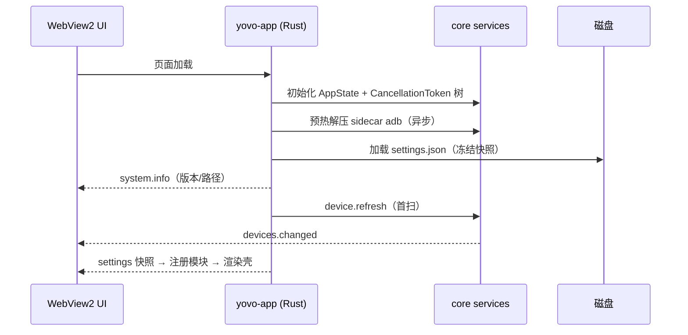
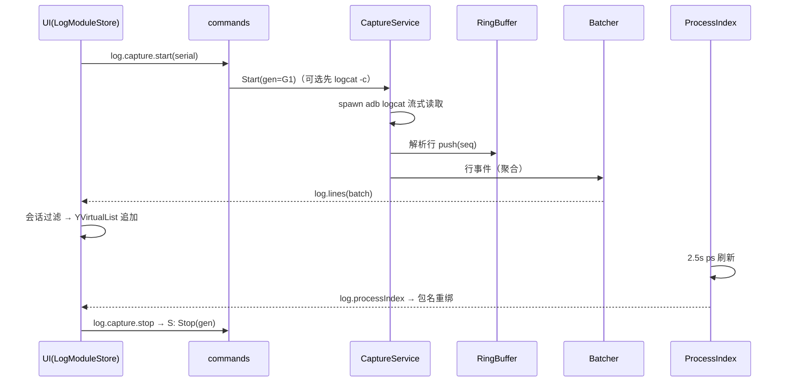

# Yovo ADB Tools — 架构设计 v6（全新架构）

> **状态：** 设计定稿（待实现）  
> **日期：** 2026-08-14  
> **配套文档：** `docs/requirements/需求分析.md`（v6 版）  
> **定位声明：** 本架构为**推倒重来的全新设计**，不兼容旧设计与旧代码。旧架构（C#/WPF 模块化单体）与旧文档仅作历史存档。

---

## 0. 一句话结论

**Rust 领域核心 + Tauri 2 桌面壳 + 自研 @yovo/ui 组件库（SolidJS）** 的模块化单体：核心逻辑全部下沉到零 UI 依赖的 Rust workspace（可独立测试、未来可服务化），UI 全部由自研组件库构建；logcat 等高频数据走**批量 IPC 事件**；安装包目标 **≤ 12 MB**，不捆绑任何语言运行时。

---

## 1. 设计目标与非目标

### 1.1 目标

| # | 目标 | 成功标准 |
|---|------|----------|
| G1 | 轻量化 | 安装包 ≤ 12 MB；复用系统 WebView2；无 .NET / 无自包含运行时 |
| G2 | 自研 UI 组件库 | 界面 100% 由 `@yovo/ui` 构成；token 单源；零第三方组件库 |
| G3 | 功能完善 | 终端 / 文件 / 日志三模块对齐需求文档 §5；多会话日志为基线 |
| G4 | 性能 | 50k 环形缓冲 + 3 会话 + 2000 可见行可交互；批量 IPC，禁逐行 |
| G5 | 中文体验 | WebView2 原生 IME，中文输入零缺陷 |

### 1.2 非目标（本期不做）

- 跨平台（macOS/Linux）：架构上不排斥，但本期只交付 Windows
- 插件热加载：模块静态组合（需求文档 §9）
- 完整 ADB 协议重实现：继续包装官方 adb.exe（ADR-v6-008）
- 多设备并行日志采集：仍跟全局焦点单设备（SingleRequired）
- 投屏：Planned 占位
- 完整查询 DSL / 正则过滤框

---

## 2. 被否决方案记录（选型依据）

| 方案 | 否决理由 | 证据 |
|------|----------|------|
| 旧架构演进（C#/WPF 修补） | 用户明确要求彻底重构；WPF 不支持 trimming/NativeAOT，自包含 ≥ 74 MB | 实测 NETSDK1168 |
| Avalonia + NativeAOT | 体积仍 ~25–30 MB；AOT 有反射限制；团队需换 C# UI 栈但收益不如 Tauri | [Avalonia AOT 文档](https://docs.avaloniaui.net/docs/deployment/native-aot) |
| Rust + Slint | 中文 IME 缺陷（微软拼音卡死）；GPLv3/商业双许可证 | [Slint #8716](https://github.com/slint-ui/slint/issues/8716)、[#3811](https://github.com/slint-ui/slint/issues/3811) |
| Rust + egui | 中文 IME 多个未决 bug；即时模式刷新与 50k 行列表性能风险 | [egui #4209](https://github.com/emilk/egui/issues/4209) |
| Electron | 体积 ~100 MB+，与轻量化目标矛盾 | — |
| WinUI 3 | 运行时依赖 Windows App SDK，轻量化不如 Tauri；生态不如 Web 前端 | — |
| C# 壳 + Rust 内核（csbindgen FFI） | 仍需背 .NET 运行时；双语言桥接复杂度高于 Tauri IPC；旧架构残留 | [csbindgen](https://github.com/Cysharp/csbindgen)（技术可行但非最优） |

---

## 3. 架构总览

### 3.1 进程与层模型

```mermaid
flowchart TB
  subgraph UI["UI 层（WebView2 内）"]
    direction TB
    APP["@yovo/app 工作台壳<br/>导航/设备栏/状态栏/设置"]
    MOD["@yovo/modules/*<br/>terminal / files / logs / mirror"]
    UI["@yovo/ui 组件库<br/>token + 组件"]
    API["@yovo/api<br/>类型化 IPC 客户端"]
  end

  subgraph SHELL["Tauri 壳（Rust）"]
    COMMANDS["commands 命令层<br/>invoke 处理 + 事件发射"]
    STATE["AppState<br/>服务实例容器"]
    SIDECAR["sidecar 管理<br/>adb.exe 解压/启动"]
    UPGRADE["升级/托盘/窗口"]
  end

  subgraph CORE["core（Rust workspace，零 Tauri 依赖）"]
    DOMAIN["yovo-domain<br/>命令库/会话/判定/安全路径"]
    ADB["yovo-adb<br/>进程/devices/流式"]
    LOGSRV["yovo-logsrv<br/>单流采集/环形缓冲/进程索引"]
    FILES["yovo-files<br/>浏览/传输引擎"]
    PROTO["yovo-protocol<br/>wire 类型（serde）"]
  end

  TOOLS["tools/sidecar<br/>adb.exe + dll"]
  DISK[("磁盘<br/>%LOCALAPPDATA%/YovoAdbTools")]

  UI --> API
  MOD --> UI
  APP --> MOD
  API -. invoke / 批量事件 .-> COMMANDS
  COMMANDS --> STATE
  STATE --> CORE
  CORE --> PROTO
  ADB --> TOOLS
  STATE --> SIDECAR --> TOOLS
  CORE --> DISK
```

### 3.2 依赖方向（唯一规则）

```text
UI（TS）   → @yovo/api → IPC ← commands（Rust）
                    ↑ 所有跨语言通信只经此一层
core crates：yovo-{adb,logsrv,files} → yovo-domain → yovo-protocol
app/commands → core crates（app 是唯一允许引用 Tauri 的地方）
禁止：core 引用 Tauri；UI 模块间互相 import；跨层绕过 IPC
```

### 3.3 核心设计原则

1. **core 零 UI 依赖**：core 只依赖 tokio/serde 等基础库，不 import Tauri。理由：可 `cargo test` 独立验证；未来出现"多工具共享采集服务"时，把 core 编译成守护进程即可，UI 一行不改（ADR-v6-005）。
2. **会话与过滤在消费端**：core 只负责采集 + 共享环形缓冲 + 进程索引；会话 Tab、过滤、可见列表全部在 UI 层 session store。重放由 `log.replay` 命令按需拉取（ADR-v6-006）。
3. **批量 IPC**：高频数据（logcat 行、传输进度）只在 core 侧聚合后以批事件推送（ADR-v6-007）。
4. **判定在领域层**：命令成败判定（失败正则 → 成功正则 → 退出码）在 yovo-domain，客户端不判定（ADR-v6-009）。
5. **组件库第一公民**：所有界面元素必须来自 @yovo/ui；色值/字号/间距一律引用 token，lint 禁止硬编码（ADR-v6-011）。

---

## 4. 工程结构

### 4.1 仓库布局

```text
yovo-adb-tools/
├── Cargo.toml                    # workspace（core/* + app/*）
├── rust-toolchain.toml           # 锁定 stable 版本
├── core/
│   ├── yovo-protocol/            # wire 类型：命令参数/返回/事件（serde，无 IO）
│   ├── yovo-domain/              # 领域：命令库/会话/判定/安全路径/设置模型
│   ├── yovo-adb/                 # ADB 客户端：进程/devices 解析/流式执行
│   ├── yovo-logsrv/              # logcat 采集服务：单流/环形缓冲/进程索引
│   └── yovo-files/               # 文件浏览/传输引擎
├── app/
│   └── yovo-app/                 # Tauri 壳：main/lib、commands、state、sidecar
├── ui/
│   ├── pnpm-workspace.yaml
│   ├── turbo.json
│   ├── packages/
│   │   ├── api/                  # @yovo/api：类型化 invoke 封装 + 事件订阅
│   │   ├── ui/                   # @yovo/ui：组件库（token + 组件 + storybook）
│   │   ├── app/                  # @yovo/app：工作台壳 + 模块注册表
│   │   └── modules/
│   │       ├── terminal/         # @yovo/module-terminal
│   │       ├── files/            # @yovo/module-files
│   │       ├── logs/             # @yovo/module-logs
│   │       └── mirror/           # @yovo/module-mirror（Planned 占位）
│   └── apps/
│       └── shell/                # Vite 入口，Tauri frontendDist 指向此处
├── tools/
│   ├── adb.exe / AdbWinApi.dll / AdbWinUsbApi.dll   # sidecar 资源
│   └── fake-adb/                 # 测试用脚本化假 adb（cargo test fixture）
├── scripts/
│   ├── verify-v6-smoke.ps1       # 冒烟回归
│   ├── verify-v6-full.ps1        # 全功能联调（需设备）
│   └── verify-v6-logs-perf.ps1   # 日志性能验收
├── docs/
│   ├── requirements/需求分析.md
│   └── architecture/架构设计-v6.md
└── tauri.conf.json
```

### 4.2 Crate 依赖图

```text
yovo-protocol ← yovo-domain ← { yovo-adb, yovo-logsrv, yovo-files } ← yovo-app
     ↑                                                                    ↑
   (serde wire 类型，全图最底层)                                  (唯一引用 tauri)
```

### 4.3 前端包依赖图

```text
@yovo/api ← @yovo/ui ← { @yovo/app, @yovo/modules/* }
@yovo/modules/* → @yovo/api（禁止模块互引，CI 用 depcheck/eslint 边界规则强制）
@yovo/app → @yovo/modules/*（仅注册表静态组合）
```

---

## 5. Rust 核心（core/）

### 5.1 yovo-protocol（wire 类型）

纯数据结构（`serde::Serialize/Deserialize`），无任何 IO 逻辑。前后端共享同一份类型定义的依据（TS 侧由 `@yovo/api` 手工对齐 + 契约测试守护，见 §10.3）。

```rust
// 核心类型（示意）
pub struct DeviceInfo { pub serial: String, pub model: Option<String>,
                        pub state: DeviceState, pub connection: String }
pub enum DeviceState { Online, Unauthorized, Offline }

pub struct LogLine { pub seq: u64, pub ts: String, pub pid: u32,
                     pub tid: u32, pub level: char, pub tag: String, pub msg: String }

pub struct LogBatch { pub serial: String, pub from_seq: u64,
                      pub lines: Vec<LogLine>, pub truncated: bool }

pub struct TransferProgress { pub id: u32, pub direction: Direction,
                              pub bytes: u64, pub total: u64, pub state: TransferState }

pub enum AppEvent { DevicesChanged(Vec<DeviceInfo>), DeviceOffline(String),
                    LogBatch(LogBatch), ProcessIndex(ProcessIndexSnapshot),
                    TransferProgress(TransferProgress), TaskSummary(TaskSummary),
                    SettingsChanged(String) }
```

### 5.2 yovo-domain（纯领域，无 IO）

| 模块 | 内容 |
|------|------|
| `command/` | `CommandDefinition`（名称/命令模板/占位符/输入提示/失败正则/成功正则）、`CommandGroup`（顺序/延时/失败中断）、`CommandLibrary`（load/save/validate）、`CommandEvaluator`（**失败正则 → 成功正则 → 退出码**）、`GroupExecutor`（组编排：多设备并行、组内串行、延时、中断） |
| `transfer/` | `RemotePath`（规范化、拒绝 `..` 穿越）、`SafetyRoot`（`/sdcard`、`/storage` 子路径判定——**core 侧强制**） |
| `session/` | `DeviceFocus`（全局焦点 + 模块选择作用域语义：MultiOptional / SingleRequired） |
| `settings/` | `SettingsKey` 枚举与默认值表（见需求文档 §4.5） |
| `applog/` | 内存环形操作日志（与设备日志严格分离） |

### 5.3 yovo-adb（ADB 客户端）

| 模块 | 职责 | 要点 |
|------|------|------|
| `tool.rs` | sidecar 解析 | 顺序：用户 `adb.path` → 应用旁 `tools/` → `DataRoot/tools/adb/` 解压；启动异步预热解压 |
| `process.rs` | 进程管理 | 短命令（收集 stdout/stderr + 退出码）、流式（逐行/逐块 stdout 泵）、**取消 = 终止进程树**（Windows Job Object 或 taskkill /T） |
| `devices.rs` | `adb devices -l` 解析 | 状态 device/unauthorized/offline；型号解析 |
| `client.rs` | 统一执行接口 | `run(serial, argv, CancellationToken)` / `stream(serial, argv, line_tx)`；并发限制（ADB server 全局并发 ≤ N，默认 8，信号量） |
| `parse.rs` | ls/ps 输出解析 | 供 files/logsrv 复用 |

### 5.4 yovo-logsrv（日志采集服务）

**ADR-v6-006 的核心落地：单流采集 + 共享环形缓冲，会话与过滤在 UI。**

| 组件 | 职责 |
|------|------|
| `CaptureService` | 每设备**至多一路** `adb logcat -v threadtime`；Start/Stop 世代管理（generation token，防止旧流迟到写入）；`clear.device.on.start` 时先 `logcat -c` |
| `RingBuffer` | 设备级共享环形缓冲（`buffer.capacity` 默认 50000）；行序号 `seq` 单调递增；设备切换/掉线 → 清空（防串设备） |
| `Batcher` | **批量协议实现**：聚合 100–200ms 或满 1000 行 / 512KB 即发批；批次携带 `from_seq` + `truncated` 标志；背压：下游事件队列有界，溢出时**不丢环**（可重放），仅丢弃推送并计数 `overflow` |
| `ProcessIndexService` | 采集中每 2.5s `ps -A -o PID,NAME` 解析包名↔PID；变更事件；失败降级"仅 PID 模式"；PID 历史集（重绑用）由 UI 会话持有 |
| `ExportService` | 按过滤条件扫描环形缓冲 → 写 txt 到 `ModuleData/log-analyzer/exports/`（core 持有全量缓冲，导出必须走 core） |

**行解析（threadtime 格式）**：`MM-DD HH:MM:SS.mmm  PID  TID LEVEL TAG: MSG`，宽容解析（格式漂移降级为整行消息，不中断采集）。

### 5.5 yovo-files（文件模块）

| 组件 | 职责 |
|------|------|
| `browse.rs` | `ls -la` 解析 → 目录条目（名称/类型/大小/权限/时间） |
| `transfer.rs` | push/pull 引擎：流式读写 + 进度（200ms 节流）→ `TransferProgress` 事件；`TransferHandle` 支持取消；完成后可选校验文件存在/大小 |
| `mutate.rs` | 删除（SafetyRoot 校验 + 用户确认由 UI 负责，core 二次强制校验）、新建目录 |

### 5.6 异步与取消模型

- tokio multithread runtime；Tauri 命令处理器与 core 服务共享 runtime。
- 取消统一用 `tokio_util::sync::CancellationToken` 树：应用根 token → 采集/传输任务 token；退出序列 = 根 cancel → 等任务收敛（超时 3s 强杀 adb 进程树）→ flush 设置。
- 错误模型：`yovo-core` 统一 `YovoError`（`Protocol` / `Adb(exit, stderr)` / `Io` / `Cancelled` / `Invalid`），IPC 层映射为 `{ code, message }`，前端按 code 处理（无需解析错误文案）。

---

## 6. Tauri 壳（app/yovo-app）

| 模块 | 职责 |
|------|------|
| `main.rs` / `lib.rs` | 组装 AppState（各服务实例 + CancellationToken 树 + sidecar 路径） |
| `commands/*.rs` | **薄命令层**：参数反序列化 → core API 调用 → 结果序列化；**禁止在此写业务逻辑**（架构测试强制：commands 模块不得依赖非 core 类型） |
| `state.rs` | `AppState`：core 服务容器；管理 AppHandle 用于事件发射 |
| `sidecar.rs` | sidecar adb 解压/路径解析/版本信息 |
| `upgrade.rs` | 预留：手动/自动检查更新（tauri-plugin-updater，远期） |
| `tray.rs` | 托盘（最小化到托盘可选，远期） |
| `panic.rs` | panic hook：写 `logs/panic-<ts>.log` + 弹致命错误提示 |

### 6.1 窗口与安全配置（tauri.conf.json 要点）

```jsonc
{
  "build": { "frontendDist": "../ui/apps/shell/dist" },
  "bundle": {
    "targets": ["nsis"],
    "externalBin": ["tools/adb"],
    "windows": {
      "webviewInstallMode": { "type": "embedBootstrapper" },  // 产线离线→offlineInstaller；极端→fixedRuntime
      "nsis": { "installMode": "perUser", "languages": ["SimpChinese"] }
    }
  },
  "app": {
    "security": {
      "csp": "default-src 'self'; style-src 'self' 'unsafe-inline'",  // 组件库 token 用注入 CSS 变量
      "capabilities": "default"   // 仅暴露本应用命令
    }
  }
}
```

---

## 7. UI 层（ui/）

### 7.1 前端技术选型理由

| 项 | 选择 | 理由 |
|----|------|------|
| 框架 | **SolidJS** | 细粒度响应式：100–200ms 一批的日志行更新只触发受影响 DOM 节点，虚拟列表 + 高频更新性能最优；编译产物小 |
| 构建 | Vite + Turborepo + pnpm | monorepo 标准组合；Tauri 官方模板同源 |
| 语言 | TypeScript strict | 与 @yovo/api 类型对齐，契约测试守护 |
| 样式 | CSS 变量（token） | 主题切换零运行时成本 |

### 7.2 @yovo/ui 组件库（自研，第一公民）

**Token 层（单源，`packages/ui/src/tokens/`）**——延续旧架构 ThemeTokens 的设计思想，载体变为 CSS 变量 + TS 常量：

```text
tokens/
├── color.ts        # 语义色：surface/text/accent/success/error/warn/offline/signal…
├── typography.ts   # 字号阶梯 11/13/14/17/20 + 字重 + 中文字体栈（微软雅黑）
├── spacing.ts      # 4px 基准：xs/sm/md/lg/xl
├── radius.ts / elevation.ts / motion.ts
└── theme.css       # :root[data-theme=light|dark] 变量注入
```

**组件清单（第一期交付）**：

| 类别 | 组件 |
|------|------|
| 基础 | YButton（primary/secondary/ghost/danger）、YIconButton、YTextField（IME 安全）、YSelect、YComboBox（可搜索，包名下拉用）、YCheckbox、YToggle、YBadge、YTooltip、YProgressBar |
| 布局 | YToolbar、YPanel、YSplitPane（拖拽分屏，分屏期用）、YStatusBar |
| 数据 | **YVirtualList**（日志核心组件：定高行虚拟化、横向滚动、自动滚底、行着色/高亮钩子）、YTree（文件浏览）、YDataGrid（命令管理） |
| 复合 | YTabs（多会话：关闭/重命名/绿点红点徽章）、YDialog（确认/脏关闭）、YToast、YEmptyState、YFormField |
| 视图 | YTerminalView（命令输出、ANSI 色）、YLogLevelChip |

**组件库纪律**：组件样式 100% 引用 token；ESLint 规则禁止在组件库外出现裸色值/裸字号；Storybook 作为组件验收台。

### 7.3 @yovo/app 工作台壳

```text
app/
├── shell/          # 主布局：左侧设备栏+导航 / 右侧内容区 / 底部状态栏
├── registry.ts     # 模块注册表（静态组合：import 各模块 descriptor）
├── device/         # 设备 store：列表/焦点/作用域/自动刷新
├── tasks/          # 后台任务中心 store（传输/采集汇总）
└── settings/       # 设置面板 + settings store
```

**模块契约（TS）**：

```typescript
interface ModuleDescriptor {
  id: string;              // "adb-terminal" | "file-manager" | "log-analyzer"
  title: string;           // 导航标题（中文）
  icon: string;            // 图标名（组件库图标集）
  selectionMode: "MultiOptional" | "SingleRequired" | "None";
  isPlanned?: boolean;     // 占位模块
  Component: () => JSX.Element;     // 主视图
  createStore?: (api: YovoApi) => ModuleStore;  // 模块状态
}
```

### 7.4 模块 store 数据流（以日志模块为例）

```text
core 事件 log.lines(batch)
  → @yovo/api 订阅 → LogModuleStore
      ├─ 设备共享缓冲镜像（可裁剪至 buffer.capacity，RingBuffer 语义）
      └─ 每会话 SessionStore { scope, filter, paused, visible: YVirtualList 数据源 }
          过滤管道：Scope(All|Package|Pid) → Level ≥ min → Tag 包含 → 关键字包含
          包名重绑：ProcessIndex 快照 → PidSet ∪ HistoryPidSet（上限 8）
          暂停 = 只停该会话追加；缓冲镜像继续
重放/回补：batch.truncated 或 overflow>0 时调用 log.replay 按需拉取
信号扫描：批内纯函数（崩溃/ANR 关键字）→ 会话 SignalCount 徽章
堆栈折叠：显示层纯函数（YVirtualList 渲染钩子）
导出：log.export（core 侧全量扫描，UI 只传过滤条件）
```

---

## 8. IPC 协议设计（全量清单）

### 8.1 invoke 命令表（`@yovo/api` 类型化封装）

| 命令 | 参数 | 返回 | 说明 |
|------|------|------|------|
| `device.list` | — | `DeviceInfo[]` | 最近一次扫描快照 |
| `device.refresh` | — | `DeviceInfo[]` | 立即 `devices -l` 扫描 |
| `adb.exec` | `{ serial, argv[] , timeoutMs? }` | `{ exitCode, stdout, stderr }` | 短命令；超时/取消语义 |
| `terminal.eval` | `{ command, serial }` | `{ ok, verdict, output }` | 领域判定（失败正则→成功正则→退出码） |
| `group.run` | `{ groupId, serials[] }` | `runId` | 组编排，进度经事件 |
| `group.cancel` | `{ runId }` | — | 取消组执行 |
| `commandlib.load` | — | `CommandLibrary` | 含 v5 数据一次性迁移 |
| `commandlib.save` | `{ library }` | — | 全量提交 + 原子写 |
| `files.list` | `{ serial, path }` | `RemoteEntry[]` | ls 解析 |
| `files.push` / `files.pull` | `{ serial, local, remote, transferId }` | — | 进度经事件 |
| `files.cancel` | `{ transferId }` | — | 取消传输 |
| `files.delete` / `files.mkdir` | `{ serial, path }` | — | core 侧 SafetyRoot 校验 |
| `log.capture.start` | `{ serial }` | — | 幂等；可选先 `logcat -c` |
| `log.capture.stop` | `{ serial }` | — | 停流，保留缓冲 |
| `log.clear` | `{ serial }` | — | 清设备共享缓冲 |
| `log.clearDevice` | `{ serial }` | — | `logcat -c` |
| `log.replay` | `{ serial, fromSeq, limit, filter? }` | `LogBatch` | 回补/会话重建 |
| `log.export` | `{ serial, filter? }` | `{ path }` | core 全量扫描写 txt |
| `settings.get` / `settings.set` | `{ key }` / `{ key, value }` | value / — | `settings.changed` 事件 |
| `system.info` | — | `{ version, dataRoot, adbPath }` | 关于/诊断 |
| `system.openPath` | `{ path }` | — | 打开导出的 txt |

### 8.2 事件表（core → UI，`listen`）

| 事件 | 载荷 | 频率/节流 |
|------|------|-----------|
| `devices.changed` | `DeviceInfo[]` | 每次扫描 |
| `device.offline` | `{ serial }` | 掉线即发 |
| `log.lines` | `LogBatch` | 100–200ms 聚合 / 1000 行 / 512KB 先到先发 |
| `log.processIndex` | `{ serial, entries[] }` | 2.5s（仅采集中） |
| `log.captureState` | `{ serial, state }` | 状态迁移即发 |
| `transfer.progress` | `TransferProgress` | 200ms 节流 |
| `group.progress` | `{ runId, device, state, verdict }` | 每命令完成 |
| `task.summary` | `TaskSummary` | 任务登记/完成 |
| `settings.changed` | `{ key }` | 变更即发 |
| `log.overflow` | `{ serial, droppedBatches }` | 溢出计数（UI 提示"落后 N 批，点击重放"） |

### 8.3 背压与一致性

```text
core:  RingBuffer（seq 单调）→ Batcher → 有界 mpsc（容量 4 批）
UI:    订阅循环快于网络 → 正常；
       落后 → mpsc 满 → Batcher 丢弃"推送"但 RingBuffer 不丢
       → overflow 计数事件 → UI 显示滞后徽章 → 用户点击/自动 log.replay(fromSeq) 补齐
导出/重放永远基于 core 的 RingBuffer 快照，与推送通道状态无关 → 数据不丢。
```

---

## 9. 关键数据流（时序）

### 9.1 启动序列



### 9.2 logcat 采集 → 扇出 → 虚拟列表



### 9.3 命令组执行

```text
UI group.run(groupId, serials[]) → GroupExecutor
  → 每设备并行 spawn；组内串行（延时/失败中断）
  → 每命令：adb.exec → CommandEvaluator（失败正则→成功正则→退出码）
  → group.progress 事件逐命令推送 → UI 结果区结构化展示
  → 全部结束 → task.summary 更新状态栏
```

### 9.4 文件传输

```text
UI files.push/pull → TransferRunner（core）
  → 流式 IO + 200ms 进度采样 → transfer.progress → UI 进度条
  → 用户取消 → TransferHandle.cancel → 终止进程树 + 清理半成品文件
  → 完成/失败 → task.summary
```

---

## 10. 数据与存储

### 10.1 路径规划（全部在 LocalAppData，无管理员权限）

```text
%LOCALAPPDATA%\YovoAdbTools\
├── settings\settings.json       # 根固定，不随 data.root 迁移
├── logs\                        # panic 崩溃日志
├── data\                        # DataRoot（可配置迁移，重启生效）
│   ├── tools\adb\               # sidecar 解压产物（含版本标记）
│   └── modules\
│       ├── adb-terminal\config\library.json
│       ├── log-analyzer\exports\*.txt
│       └── file-manager\        # 传输临时区
```

### 10.2 命令库 schema（v6，全新定义）

```jsonc
{
  "schemaVersion": 2,
  "groups": [
    { "id": "g-1", "name": "开机检查", "tags": ["产线"],
      "commands": [
        { "id": "c-1", "name": "查看版本",
          "template": "shell getprop ro.build.version.release",
          "inputs": [],                       // {0}/{1} 占位符提示
          "failureRegex": "", "successRegex": "",
          "delayMs": 0, "abortOnFail": true }
      ] }
  ]
}
```

- 原子写：临时文件 + rename；损坏时备份为 `.corrupt-<ts>` 后重建。
- **v5 数据一次性迁移**：首次启动检测旧 `library.json` 路径，存在则转换并标记完成（数据迁移，非设计兼容）。

### 10.3 设置存储

- `settings.json`：schema version + 原子写；键表见需求文档 §4.5。
- 生效语义：`adb.path` 立即；`data.root` 重启；其余按键表。

---

## 11. 部署与打包

### 11.1 目标体积构成（预算）

| 项 | 预算 |
|----|------|
| Rust 主程序（yovo-app + core，release/LTO） | ~6–8 MB |
| 前端资源（gzip 后） | ~1–2 MB |
| sidecar adb 工具链 | ~6.7 MB（压缩后 ~3–4 MB） |
| 安装器（NSIS，含 WebView2 引导 stub） | ~1 MB |
| **合计（安装包）** | **≤ 12 MB** |

### 11.2 WebView2 部署模式（产线场景决策树）

| 场景 | 配置 |
|------|------|
| 常规联网机器 | `downloadBootstrapper`（默认） |
| 产线有统一镜像 | 镜像一次性预置 **Evergreen WebView2**（推荐，最省心） |
| 产线离线但允许安装包稍大 | `offlineInstaller`（内嵌 WebView2 安装器 ~2 MB，安装时执行） |
| 极端离线 + 禁网 | `fixedRuntime`（~150 MB，仅兜底，破坏轻量目标） |

### 11.3 发布流水线

```text
cargo test → cargo clippy -D warnings → 前端 typecheck + test + build
→ tauri build（release + LTO + strip）
→ 冒烟脚本（verify-v6-smoke.ps1）→ 全功能联调（需设备）→ 发布产物签名（远期）
```

---

## 12. 测试策略

| 层 | 工具 | 覆盖 |
|----|------|------|
| core 单元 | cargo test | 解析器（devices/ls/ps/threadtime 多版本样例）、判定器、安全路径、环形缓冲、Batcher 聚合/溢出、导出 |
| core 集成 | cargo test + **fake-adb** | `tools/fake-adb/` 脚本化假 adb.exe（可编程输出/延迟/退出码），覆盖采集世代切换、取消、掉线清缓冲 |
| 前端单元 | Vitest | 会话过滤管道、信号扫描、堆叠折叠、store 回补逻辑、组件库组件 |
| 契约测试 | 双向 fixture | @yovo/api 类型与 yovo-protocol wire 样例 JSON 对齐（防 IPC 类型漂移） |
| E2E | tauri-driver | 冒烟：启动/导航/设备列表/设置读写 |
| 手工联调 | scripts/verify-v6-*.ps1 | 需真实设备：终端执行/文件传输/日志多会话（对齐旧版验收粒度） |
| **性能验收** | verify-v6-logs-perf | 50k 缓冲 + 3 会话 + 2000 可见行：批量 IPC 平均 < 16ms/批、UI 交互不掉帧、滚动无卡顿 |

---

## 13. 安全与健壮性

| 项 | 措施 |
|----|------|
| 路径安全 | 文件删除/新建：core 侧 SafetyRoot 强校验（不信任 UI）；RemotePath 规范化拒绝 `..` |
| IPC 面 | CSP 收紧；capabilities 仅暴露本应用命令；core 校验所有输入（路径/序号/大小上限） |
| 命令执行 | 终端执行 adb 命令是产品功能本身；但 core 对 argv 注入做校验（禁止空参、长度上限），组执行有超时 |
| 崩溃 | Rust panic hook 写日志 + 提示；JS 全局错误经 `system.reportError` 记录；崩溃日志不落设备数据 |
| 退出序列 | 根 CancellationToken cancel → 采集/传输收敛（超时 3s 强杀 adb 进程树）→ 设置 flush |
| 数据 | settings/library 原子写 + 损坏备份；导出 txt 文件名含时间戳，防覆盖 |

---

## 14. 决策记录（ADR-v6 全量）

| ID | 决策 | 结论 |
|----|------|------|
| ADR-v6-001 | 重建方式 | 推倒重来，不兼容旧设计/旧代码；strangler fig 模块级迁移；旧版维护至 S4 |
| ADR-v6-002 | 语言栈 | Rust（core）+ TypeScript（UI）；否决纯 Rust 原生 GUI（Slint/egui 中文 IME 缺陷：slint #8716、egui #4209） |
| ADR-v6-003 | UI 载体 | Tauri 2 + WebView2：体积（≤12MB）、IME（浏览器级）、生态三赢；参考 GitButler 生产案例 |
| ADR-v6-004 | 前端框架 | SolidJS（细粒度响应式匹配批量日志更新）；Svelte 5 为等价备选 |
| ADR-v6-005 | core 边界 | core 零 Tauri 依赖；可独立测试/未来服务化 |
| ADR-v6-006 | 采集模型 | 单设备单 logcat 流 + core 共享环形缓冲；**会话/过滤/可见列表在 UI 消费端**；重放经 `log.replay` |
| ADR-v6-007 | IPC 批量协议 | 100–200ms 聚合、单批上限 1000 行/512KB；禁逐行；溢出丢推送不丢环（可重放） |
| ADR-v6-008 | ADB 协议 | sidecar 官方 adb.exe；不重实现协议（Rust crate 生态不成熟） |
| ADR-v6-009 | 成败判定 | 领域层 CommandEvaluator（失败正则→成功正则→退出码）；客户端不判定 |
| ADR-v6-010 | 日志分离 | 应用日志（内存环形）与设备日志（logcat 缓冲）严格分离 |
| ADR-v6-011 | 组件库 | @yovo/ui 第一公民；token 单源；lint 禁硬编码 |
| ADR-v6-012 | 模块组合 | 前端模块静态组合（无插件热加载）；模块间零 import（depcheck 强制） |
| ADR-v6-013 | 安全根 | 删除/新建由 core 侧 SafetyRoot 强制校验 |
| ADR-v6-014 | 部署 | NSIS per-user + WebView2 embedBootstrapper 默认；离线产线 offlineInstaller/镜像预置 |
| ADR-v6-015 | 投屏/MES | 投屏 Planned 占位；MES 预留不实现 |

---

## 15. 落地路线（strangler fig，平行重写）

| 阶段 | 内容 | 验收标准 |
|------|------|----------|
| **S1 骨架（2–3 周）** | Cargo workspace + Tauri 壳 + @yovo/ui token/基础组件 + @yovo/api 契约层 + sidecar adb + 设置/设备栏 | 空壳安装包 ≤ 12 MB；设备扫描/设置可用 |
| **S2 终端模块（2–3 周）** | yovo-domain 命令库/判定/组编排 + 终端 UI + v5 library.json 迁移 | 终端功能对齐旧版；判定用例全绿 |
| **S3 文件模块（1–2 周）** | yovo-files + 文件浏览/传输 UI | 传输进度/取消对齐旧版 |
| **S4 日志模块（2–3 周）** | yovo-logsrv + YVirtualList + 多会话 Tab + AS 过滤栏 + 导出 | 性能验收全绿（§12 末行） |
| **S5 切换（1 周）** | 设置迁移、产线镜像预置 WebView2、旧版退役 | 全功能联调全绿；旧版下线 |

**总计约 9–12 周（2 人）。** 旧版在 S4 验收前继续维护；用户数据（命令库/设置）在 S5 一次性迁移。

## 15.1 实现状态（2026-08-14 起持续回写）

| 阶段 | 状态 | 落地要点与验证 |
|------|------|----------------|
| **S1 骨架** | ✅ | Cargo workspace 五 crate；Tauri 壳 25 条命令全量接线；@yovo/ui 组件库（14 组件 + YDialog/YToast，token 单源，深浅主题）；@yovo/api 契约层（fixture 单测）；工作台壳（设备栏/导航/设置/状态栏/模块注册表）；sidecar adb |
| **S2 终端模块** | ✅ | 默认命令库（3 组 9 命令，首次启动/损坏重建原子写入）；组编排（多设备并行/串行/延时/失败中断）；成败判定（失败正则→成功正则→退出码）；命令管理（快照编辑/全量提交/取消零污染）；占位符填值对话框；结果日志流 |
| **S3 文件模块** | ✅ | YVirtualList 目录浏览；上传/下载（tauri-plugin-dialog）；删除确认 + core 侧 SafetyRoot；新建目录；传输面板（进度/取消/状态）；路径纯函数单测 |
| **S4 日志模块** | ✅ | 多会话 Tab（全部/包名/PID）；AS 风格过滤栏（级别含以上/Tag/关键字，无正则框）；进程索引 2.5s + 包名 PID 重绑（历史集上限 8）；信号扫描/堆叠折叠/溢出回补/导出；快捷键 Space/Ctrl+L/F/T/W/Tab；pipeline.ts 纯函数管线 + 单测 |
| **测试基建** | ✅ | fake-adb 脚本化 fixture（零共享状态，并行安全）；采集集成测试 7 用例；期间修复 run_capture 忙循环与 Batcher 尾部批次丢失两个真实缺陷 |
| **S5 切换** | 🔶 | verify-v6-smoke/full/logs-perf 脚本就绪；NSIS 安装包与真机联调待产线环境执行 |

**验证现状：** `cargo build --workspace && cargo test --workspace` 全绿（60 用例，含 7 集成）；clippy -D warnings 0 警告；Vitest 96 全绿；tsc -b 0 错误；release exe **6.36 MB**（≤12 MB 达标；lto + codegen-units=1 + strip + panic=abort）。

**与设计的偏差记录：**
1. `tauri-plugin-dialog` 新增（S3 上传/下载文件选择器，capability 已授权）——架构文档 §6 未列，属合理增量。
2. 模块注册点位于 `apps/shell` 入口（而非 @yovo/app 内部）——避免 app→modules 循环依赖，符合依赖方向约定。

---

## 16. 风险与开放问题

| 风险 | 等级 | 应对 |
|------|------|------|
| 团队双栈学习曲线（Rust + TS/Solid） | 高 | S1 骨架期定 lint/测试/CI 规范；core 先做纯函数型领域（易上手） |
| 高频日志 IPC 设计不当 | 高 | 批量协议为架构级约束（ADR-v6-007）；S4 独立性能验收 |
| 产线镜像缺 WebView2 | 中 | §11.2 决策树；S5 前与产线 IT 确认镜像策略 |
| YVirtualList 虚拟化实现质量 | 中 | 组件库 Storybook + 性能验收；必要时引入成熟虚拟化原语做底层（非 UI 库） |
| v5 数据迁移边界不清 | 低 | 明确"仅 library.json + settings"一次性迁移；其余不迁移 |

**开放问题：**
1. 设置面板是否需要"数据目录迁移"向导？（v5 有，v6 建议 S1 暂不做，S5 按需）
2. `theme` 深色主题是否进入第一期？（组件库 token 已预留；建议 UI 排期第二期）
3. 日志会话配置（workspace.json）是否持久化？（建议分屏期一并做）

---

**文档结束。**
